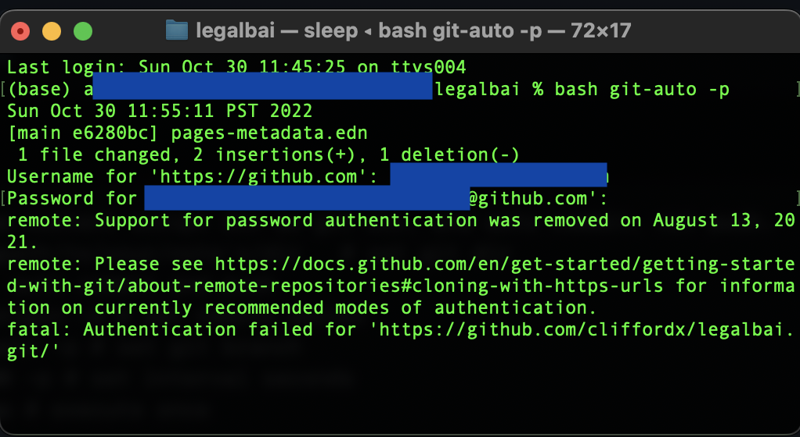
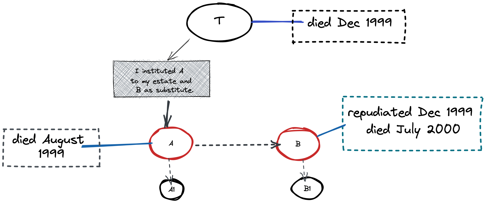

- ### Logseq-related work
	- setting auto commit using [git-auto](https://github.com/logseq/git-auto). Let's see if it works...
	- commit and push. On Mac, type:
	- ``` git
	  bash git-auto -p
	  ```
	- need auth.
	- Update:
		- {:height 344, :width 642}
			- It says:
		- > "*Support for password authentication was removed on August 13, 2021.
		  remote: Please see https://docs.github.com/en/get-started/getting-started-with-git/about-remote-repositories#cloning-with-https-urls for information on currently recommended modes of authentication.*"
	- Setup personal access token... and then boom! LGTM.
	- **[12:10]** Success!
- **[12:59]** Example problem in [[Succession]]
	- a) T provides in his will —
		- >“ I institute A to my estate and B as substitute."
		- A has a son A-1 while B has a son B-1.
		- T died on November, 1999 while A died           ~~on~~ [in August] 1999.
		- B repudiated on December, 1999 and died on July, 2000.
		- Upon the death of T, who shall inherit the property subject of institution.?
			- 1.) A and later A-1 in representation of A.
			- 2.) Intestate heirs of T
			- 3.) B and later B-1 in representation of B
			- 4.) B as heir of B
			- 5.) B as substitute of A.
			- 
			- **ANSWER:** 2
				- *from <redacted>*
					- Reason: **ARTICLE 859.** provides:
					- {{embed ((635bc742-8abc-432a-aa77-7b85395411b3))}}
					- This article provides the express substitution in case of —
						- a. instituted heir predeceased the testator,
						- b. renunciation or repudiation of the substituted heir, and
						- c. incapacity to accept inheritance .
					- However, Substitution can be extinguished by reason of:
						- (a)  when the substitute predeceased the testator
						- (b)  when the substitute is incapacitated
						- (c)  when the substitute renounces the inheritance
						- (d)  when the institution of heir is annulled (i.e., by preterition)
						- (e)  when the institution or the substitution is revoked by the testator
						- (f)  when a will is void or disallowed or revoked
					- In the example problem, it is clear that A predecease the testator when A died months earlier (august 1999) than T (November 1999). Hence, A-1 which is the voluntary heir of A cannot inherit. B as substitute cannot also inherit reason that B repudiate the inheritance of T. By the act of B renouncing the inheritance of T, it only means that B is not interested and would not take any legal obligation to assume the estate property of T.
					- Since B repudiated the heir of B which is B-1 cannot also inherit.
					- Moreover, since both A and B are not capable of receiving the estate of T. The property of T shall be form part back to intestate heirs of T.
				- *from Paras*
					- The following three (3) requisites must satisfy to qualify that there is a valid institution of heir.
					- 1) The will must be EXTRINSICALLY VALID. (Hence, the testator must be capacitated, the formalities must be observed, there must be no vitiated consent, the will must have been duly probated, the will must have been the personal act of the testator.)
					- 2) The institution must be valid INTRINSICALLY. (The legitime must not be impaired, the heir must be certain or ascertainable; there should be no preterition).
					- 3) The institution must be EFFECTIVE (no predecease, no repudiation by the heir, no incapacity of the heir).
				- From Jurado
					- See: When Substitution Takes Place.