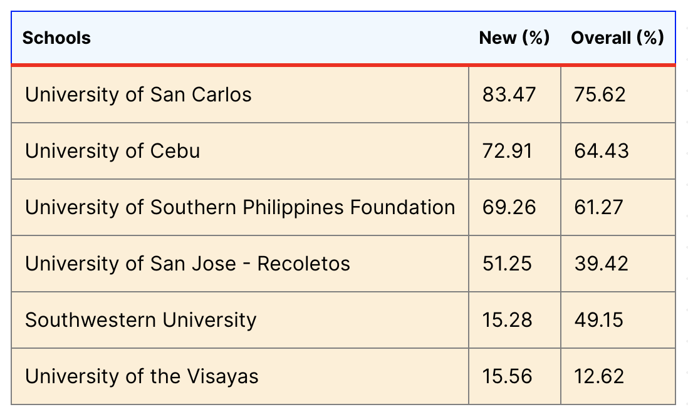

- **[14:08]**  LEB ranking of law schools [https://leb.gov.ph/report-on-the-10-year-performance-of-legal-education-institutions-in-the-bar-examinations-2011-2020](https://leb.gov.ph/report-on-the-10-year-performance-of-legal-education-institutions-in-the-bar-examinations-2011-2020)
# Cebu's Top LEIs with their Overall and New Examinees’ Performance (2011-2020)
	- 
	-
# Cebu's Top LEIs with their Total Bar Passers and Share in the National Population of New Lawyers (2011-2020)