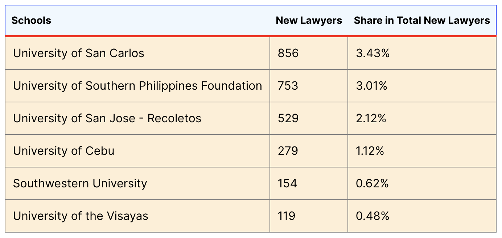

- **[14:08]**  LEB ranking of law schools [https://leb.gov.ph/report-on-the-10-year-performance-of-legal-education-institutions-in-the-bar-examinations-2011-2020](https://leb.gov.ph/report-on-the-10-year-performance-of-legal-education-institutions-in-the-bar-examinations-2011-2020)
  id:: 635f4485-e9c0-45cb-909c-a924c7494ebb
# Cebu's Top LEIs with their Overall and New Examinees’ Performance (2011-2020)
	- 
	-
# Cebu's Top LEIs with their Total Bar Passers and Share in the National Population of New Lawyers (2011-2020)
	- 
- **[19:47]**
	- {{embed ((63610783-e8fa-47af-80d8-bd1ce0f6bcc4))}}
	  id:: 96f9c585-177e-4fe7-a253-797dc1dafe43
- [[Comments]]
  collapsed:: true
	- [[Thursday, Nov 3rd, 2022]]
	  collapsed:: true
		- ((635f4485-e9c0-45cb-909c-a924c7494ebb))
			- This is not the de