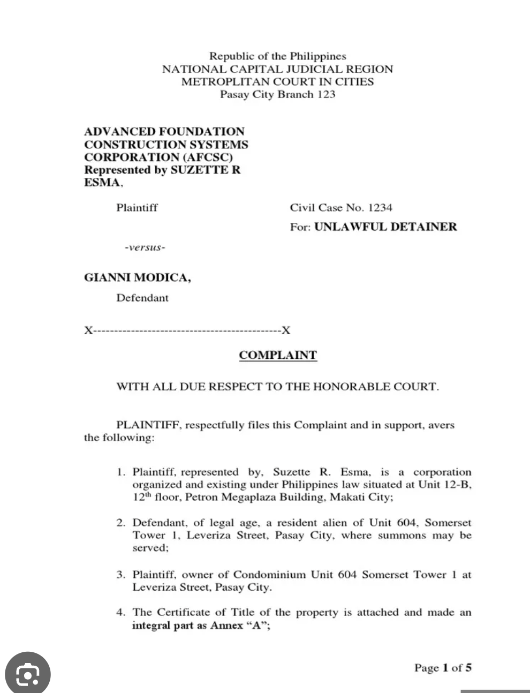

- **[08:15]** I have compiled ~~164~~ 159 cases into a PLAIN text file for MVLopez, arranged by year starting from 2020 up to the latest cases in 2023. The file is available on my GitHub account [here](https://github.com/cliffordx/MVLopez-FULL-CASES) or you can search for "MVLopez Full Cases."
- **[09:05]** Actively updating this github page. Uploaded two (2) 2023 bar syllabus: [Criminal]([[BarSyllabus/2024/Criminal Law]]) and [Remedial.]([[BarSyllabus/2024/Remedial Law]])
- ### STUDY NOTES for TODAY #[[review/Remedial Law]] #[[The Paksiteer Notes]]
	-
	- # ((65161f93-1c00-4214-922b-a32dd8627695))
	- {{embed ((65179f13-c383-4fc4-a162-d7f56c0bb294))}}
	- > Summary of today's discussion: The following topics were covered:
		- [Complaint](((6517b324-cbce-4393-88e1-0a5958a4993a)))
		- [Answer](((6517b324-f5c6-458a-b249-e1e097be23f8)))
		- [[Defenses]]
		- [[relief]]
	- ### Kinds of pleadings 
	  background-color:: purple
	  [[ROC_Annotated/PART_1/Rule 6]]
		- Unsa maning[^0] pleading?
			- It is a written statements[^1] of the respective claims and defenses of the parties admitted to the court for appropriate judgment.
			- Pasabot aning pleading kanang`pamotbot`  diha sa dokumento nga ihatag sa korte para desidiran sa huwes. Ato lang ingnong pamotbot[^a] kay sa pagkatinuod, ang mga statements diha in favor sa nagsuwat, nagsulti nga mao ni esuwat.
				- **Heads up:** Ato nya ning hisgutan kaning truthfulness kay paksit jud kung pataka tag alleged sa pleadings nga dili tinuod. **Kay ngano man?** Ma chargan tag violation sa RPC, kanang [[perjury]] kay e-under oath mana ang complaint.
				- [^0]: _{I write Bisaya because of selfish reasons. First, I will write most of the contents here for my own use and benefit so that I can understand the subject better. Second, I build this page as my way of expressing what I know during my law review. In short, this page is for my own learning.}
				- [^1]: _{Kaning written statements, obviously walay *oral pleading*. Unya I'm sure English language jud. Pangutana, pwede Bisaya or some are in Bisaya? *Akong matubag ani kay English jud unya portion of it could be in local language, like utterances in the details of the pleading.*}
				- [^a]: _{Mga allegations nga pwede tomo2x ra, uban tinuod, usahay pakapinan, pun-an or kuha-an maong naa tay korte mohatag og judgment.}
		- *Unsa mang mga pleadings nga allowed sa Rules of Court?*
		  background-color:: yellow
			- Mao ni: 
			  > Tagsa-tagsaon ta ni, ila-ilahon ta kining mga mananapa. 🦌
				- #### 1. Complaint
				  background-color:: blue
				  id:: 6517b324-cbce-4393-88e1-0a5958a4993a
					- Complaint kay reklamo ni sa bisaya. Unsa sad ng original complaint? Di ba kung dunay mi-violate sa atong right naa tay cause of action. Naa ni sa Rule 2 sec. 2, ROC. Gi-ingon diha:
					  id:: 67eaa9b6-a1f9-4a3d-985b-24b5e6bee72f
						- > A cause of action is the act or omission by which a party violates a right of another.
						- Kaning original complaint is also called initiatory pleading. Maoy nag initiate nga mahimo kaso.
						- Unsay elements sa [[cause of action]]?
						  background-color:: red
							- (1) legal right sa plaintiff (nagreklamo)
							  background-color:: yellow
								- such legal right must:
									- seek damages
									- restore that right or obligations, which lead us now in element \#2
							- (2) corresponding obligation of defendant (gi-reklamo) to respect or dili e-violate ang legal right sa plaintiff. Kung na-violate or wala gi-respect which will lead us now to element \#3
							  background-color:: green
							- (3) act or omission of defendant which violates the legal right of plaintiff constituting a breach of the obligation of defendant to plaintiff
							  background-color:: pink
								- Kaning sa \#1 legal right sa plaintiff seeking [[relief]] , unsa maning relief? Discuss nato ni [dire]([[relief]]) unsa ni mananapa 🦌.
							- ##### Cause of action vs. [Right of Action?]([[Right of action]])  unsa may distinction ani nila?
								- *a. Cause of action*
									- (1) ==reason== for bringing an action
									- (2) formal statement of the operative facts that give rise to remedial rights
									- (3) matter of procedure and is governed by the pleadings filed by the parties
								- *b. Right action*
									- (1) ==remedy== for bring an action
									- (2) the remedial right to litigate because of the operative facts
									- (3) matter of right and depends on substantive law
									- (4) affected by [affirmative defenses]([[affirmative defense]]) (fraud, prescription, estoppel, etc.)
					- Sec 3, Rule 6, Rules of Court provides the definition:
						- {{embed ((65161f8d-97b0-495a-85e8-1b3b1d63b165))}}
						- The rule now requires that the complaint need to alleged the **[[ultimate facts]]** including the **evidence** constituting the plaintiff cause of action. (Rule 8, [sec. 1](((65161f8d-10e5-4de6-84bd-ea4d988607c3)))) *Jump to:* [[ultimate facts]]
							- > Side note: before nako buhi-an ning topic nga COMPLAINT, I will make sure I covered everything, every topic regarding complaint unya apil ang iyang nga anak2x, i.e., complaint-in-intervention, third (4th-party) complaint, etc.
						- So, maghimo tag sample Complaint
							- {:height 334, :width 458}
								- (sample of complaint pic from *Scribd*)
						- #### Nature of the action
							- Karon atong e-determined unsay nature sa action diha sa pleading. Unsaon man nato pagkahibaw kung real action ba na or personal action ba na?
								- ==Tan-awon ang allegations sa complaint. unsay nakabutang diha sa dokumento ang `pamotbot` sa nagreklamo.== Ug unsay gusto sa plaintiff nga iyang gusto mahitabo. (relief sought) `Syaro di masud sa akong utok.`[^2]
									- [^2]: _{*Disclaimer:* Mga binisaya nako nga pulong gikan ni nako pero dili kalikayan nga mga gilitok sa akong mga professor mahimo pud nakong ako pinulungan. Pasaylo-a kung dili nindot ang mga gpanglitok dire ug dili ha-om sa imong paminaw.}
								- Dihay kaso, *Sanchez v. People*[^3], ang label or caption sa complaint kay **action for sum of money** and **damages.** Pero ang allegations kay rescission of contract based on the allegations of the complaint. Miingon ang SC nga ang pa-determine sa action is based on the allegations of the complaint and the character of the relief sought and not its title or caption.
									- [^3]: ^{G.R. No. 204589, 19 Nov. 2014.}
								- Example kung ang petitioner-plaintiff filed a "Petition for Certiorari" based on [Rule 65]([[ROC_Annotated/PART_1/Rule 65]]) pero ang allegations nag state that the issues raised are pure questions of law, `aw dili` Rule 65 `kundi` Rule 45.^{Sanchez v. People, supra.}
									- > Rule 65 raises an issue of jurisdiction while Rule 45 raises pure question of law. Nag advance nako dire dapita pero ato ning e-mention. I will come back to this topic later.
								- *Another case.* In *Gochan v. Gochan*[^4], the action involved is really a real action dili specific performance. Ang complaint nag state of one for specific performance where the allegations and relief prayed for is ultimately and actually seeking for an execution of deed of reconveyance of real property, in effect a transfer of ownership of a real property maong [[real action]] and not [[personal action]].
									- [^4]: _{372 SCRA 256, 264-264.}
				- #### 2. Answer
				  background-color:: green
				  id:: 6517b324-f5c6-458a-b249-e1e097be23f8
					- **[13:49]** unsa maning Answer? sa bisaya lahig meaning halos pare-parehas lang ni ang answer og reply. Mora2x parehas pero dili jud parehas. In law, it has different connotation.
					- Answer is a "responsive" pleading. It *responds* to a claim by the plaintiff.
					  background-color:: red
					- **Nature of answer:** Rule 6, sec. 4:
						- {{embed ((65164d87-12fd-4af4-a8a4-cf450410e4d8))}}
					- Sa ato pa diay kaning answer usa ka pleading sa party nga modefensa (defending party/gi-reklamo nga party) kung diin adto nya e-estate iyang mga defenses. [KANI morag MANI]().
					- So ang answer could be:
					  background-color:: yellow
						- answer to the complaint
						- answer to third-party (fourth-party, etc) complaint
						- answer to counterclaim or
						- answer to cross-claim.
					- Atong e-recall sa initiatory pleading, ang complaint sa plaintiff mi-state ug cause of action and his/her [prayer for relief]((651663a6-9274-4f07-876c-6c3e3ede5d10)). When filed in court, paid appropriate fees, the clerk of court will issue corresponding [[summons]] to the defendant. Now si defendant upon receiving the summons, pagbasa niya dapat mo answer siya sa complaint, kung unsay allegations diha sa complaint. Naa mana  diha content sa summons `"You are hereby blah blah to answer the blah blah…"` _{Syaro di masud sa akong utok inig take nakog bar next year. :)}
					- ##### UNSAY OPTION ni DEFENDANT?
						- Naay diay option si defendant with regard on how to answer the complaint. Modepende ang option sa situation.
						- **Example:** Pwde sya mo file of [[Bill of particulars]] (BoP). Bill of particulars is a litiguous motion naa mabasa sa Rule 15 [Sec. 5(a).](((65164d80-6932-489a-9cd1-87d71129623c)))
							- A motion for BoP are filed if defendant mag need og clarification or dugang detalye batok nya about sa allegations in the complaint. Kay basin dili sya marespond ug tarong kay dunay wala nya maklaro diha sa allegations. [Rule 12]([[ROC_Annotated/PART_1/Rule 12]]) naka laid out ang procedures sa BoP. It's a matter of reading direing dapita.^{But will still revisit this in the ff. days.}
						- Sa book ni Riano[^6], miingon sya: *"==He may also file a motion to dismiss if a ground exists for the immediate dismissal of the complaint. If no ground for either motion exists, the wiser move is to serve and file his answer to the complaint to prevent his being declared in default.=="*
						- Dili ko sure kung applicable pa ni gihapon sa 2019 amendments. But let's find out.
							- [^6]: _{*p. 323* Civil Procedure,Vol 1,  2019 edition; I will be referring his book often kay simple pagkahan-ay, pero this is before the amendments. But I will not limit to Riano only. I have other sources: De Leon, Mogello and Noche, among others.}
					- #### Defenses
						- Now nagmention sa sec. 4, Rule 6 sa last part about defenses. [So atong ilailahon ning mananapa 🙉.]([[Defenses]])
				- 3. Counterclaim
				- 4. Reply
				- 5. Third pary (4th party, etc) complaint
				- 6. Complain in intervention , answer in intervention.
			- Pangutana: Naa sad diay pleadings nga DILI allowed sa Rules of Court? NAA.
			- Naa say pleadings nga allowed ug dili allowed under SUMMARY PROCEDURE or for filing of SMALL CLAIMS ug uban pa. (kanang sa Writ of Amparo, etal.)
- **[14:16]** It's my first time doing the `STUDY NOTES for TODAY` here on my github page and I notice that it's more engaging "for me" because I can write what I understand, based from the book, codal, and cases. I think I got a good start.