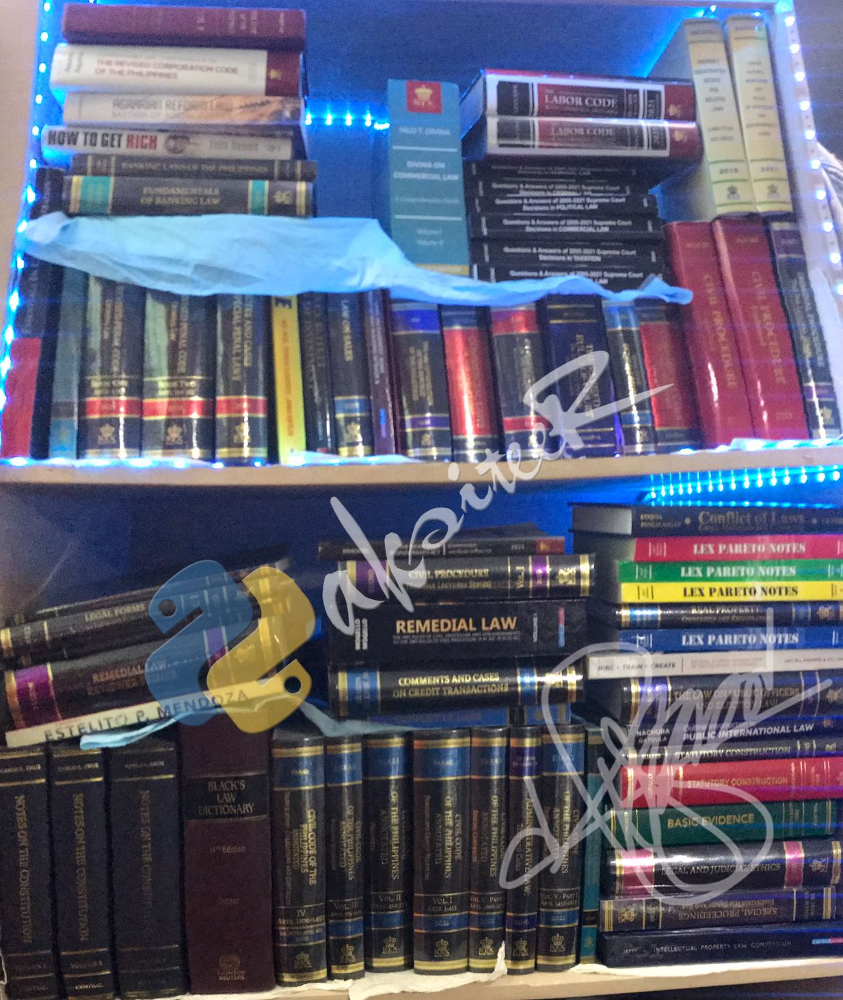
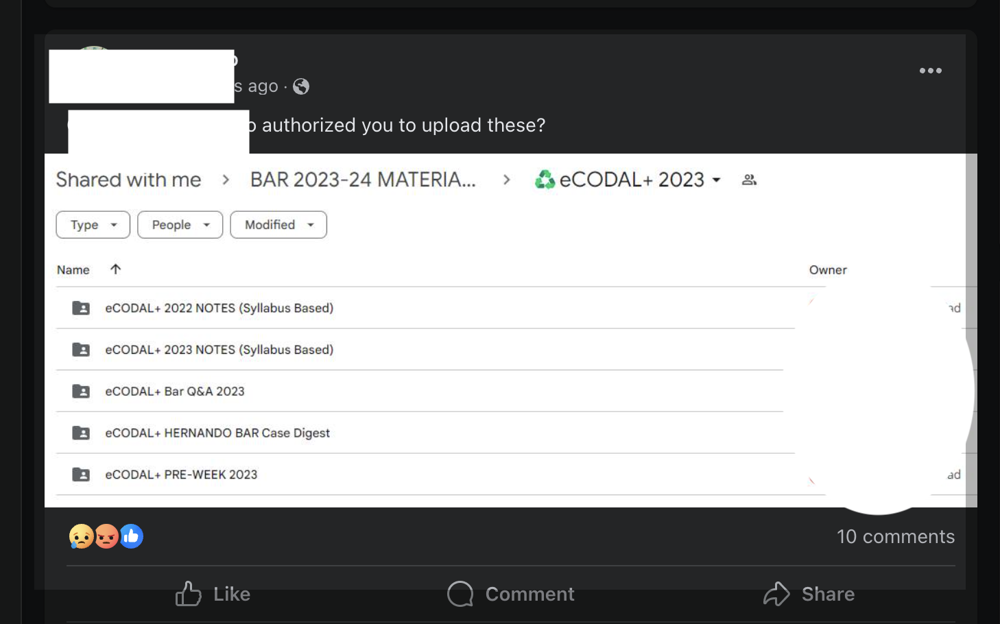

- **[11:43]** I just uploaded 2024 Bar Syllabus for [[BarSyllabus2024/Civil Law]].
	- > NOTE: For those who are following and using this as a guide for reviewing the subject, you can utilize the copy/embed function and make notes for each day of the week or according to your preferred study schedule.
- **[11:49]** review time for topic: **Marriage** #[[review/Civil Law]] #[[The Paksiteer Notes]]
  background-color:: blue
	- {{embed ((651b8d76-3625-4a6e-83ae-11312d2089e6))}}
	- So Article 1, e-memorize ni, if possible because mao ni foundation sa topic sa Family Code. Article 1 provides:
		- {{embed ((65179f14-cfe9-4c1c-be31-deb4c02f6165))}}
	- #### Aspects of marriage:
	  background-color:: yellow
		- ##### 1) it is a special contract
		  background-color:: green
			- Consequences of marriage are FIXED by law. ((65179eef-e17f-41db-a771-d011462fc4d5))
			  background-color:: red
				- {{embed ((65179eef-9c37-4a4f-ace0-2efdb3dca3aa))}}
				- DILI ma subject to stipulations. Maka affect sa property relations, or property rights.
					- > Later ato nya ni hisgotan regarding [marriage settlements.]([[marriage settlement]])
				- Kung pananglitan dunay contract nga mag-agree ang banag-asawa magkig-carnal knowledge sa lain party, subject diay na sa **disciplinary action**. That's according to *Biton v. Momongan,* 62 Phil. 7.[^1]
					- [^1]: _{Interesting case. Basahon bi.}
				- Naay balaod regarding matching Pinay for marriage to foreign nationals on a mail-order basis and other similar practices. Its R.A. No. 6955. You might want to [read that law.](https://www.officialgazette.gov.ph/1990/06/13/republic-act-no-6955/)
		- ##### 2) it is a status
		  background-color:: blue
			- or relation or
			- an institution
			- Purpose of marriage is to establish conjugal and family life. Since marriage is a foundation of family and conjugal life, it is protected by the State.
				- Art. 15, sec 2, Constitution:
					- {{embed ((65179eff-1f6f-4b37-a721-2cf798f42186))}}
			-
- **[12:53]** Just a quick note about sharing content; I'm referring to law notes, reviewers, etc., that are available online.
  background-color:: red
  id:: 651ba20e-e398-4769-9522-a027348d601c
	- To provide some context, we live in a time where there is an abundance of information. I remember a few years ago, when I was in law school, I struggled to find relevant law-related PDFs. The information I found was often scarce or outdated. I always wanted to access the latest editions.
	- Soon after joining the legal profession, I came across numerous ebooks. In fact, the sheer volume of available options was overwhelming. However, instead of relying solely on digital copies, since I had the means and could afford physical books, I began collecting them. My personal law library now consists of over seventy (70) books across different authors.^{(some good authors, some bad authors, few worst authors)}
		- 
			- ^{Fig. 1: My law book collections since first year in law school. By the way, not all books are in that shelf, the photo taken last 2 August 2023.}
	- There was an occasion where I come across PDFs online that I find interesting and well-presented. If I like the content, I purchase a copy for my own personal use. It's important to note that my intention is to use the physical book for my own consumption. I am aware of the implications of selling your own book, for example, only to find it later it was photocopied and shared online in digital format. That's one just example. There are other situations which I will share below.
	- Studies have shown that sharing pirated books negatively affects authors, as it infringes on their copyright. On the bright side, readers who come across pirated copies may choose to purchase the genuine book. I am one of them.
	  
	  > **SIDE NOTE:** While there are excellent law authors, there are also some who fall short. I have recommendations and opinions on how they can improve their work. For example, **they could provide readers with a way to provide feedback on typographical or grammatical errors or inform them about amendments to certain provisions**. This could be done through an erratum page or an addendum to the book. I have seen at least one "law content provider" doing this, but unfortunately, the ==almost all ignore such improvements and continue releasing updated versions with the same errors year after year==. Even minor details are sometimes left unchanged for many years. This issue is not exclusive to lesser-known authors, but even renowned ones like Reyes.[^2] I have encountered even worse cases, especially in Labor Law: compendiums by a Cebuano author with the ponencia by Justice Leonen, which are riddled with errors. *SUS! May ilabays basurahan.*
		- [^2]: _{*There was a provision regarding prescriptive period for the crime of Anti-Graft and Practices Act which was amended from* ~~10 15~~ *to 20 years, yet the 2021 edition of Book 2 is still 10 years! Di ba kadakong sayop nga naabot nalang 2021 wala pa maupdate. I won't call it disgusting but disappointing!*}
	- ### Copyright Infringement
		- I'm writing today because as I was scrolling through an FB group, I noticed an author asking who uploaded their work without his permission — a case for violation of his copyrighted work. The uploader even had her name on the GDrive, with her first, middle, and last name clearly displayed. It's obvious that ignorance is not an excuse in this case. She had her name on the GDrive complete with her first, middle and last name as the uploader.
			- 
				- ^{Fig.2: Redacted for protection.}
		- Now, the author whose work was uploaded without permission has every right to be concerned and angry. Just weeks ago, this same author was saddened to find their work, which is meant for paid members only, being shared online for free. As law-abiding citizens, we should not tolerate this behavior.
		- But let's be honest, who among us can claim innocent? Someone might say, "I swear on my life, I have never downloaded or will never read any pirated law-related PDFs." But that's absolutely B.S., right? Pure B.S.[^3] That's another instance of [[cognitive dissonance]].
			- [^3]: _{Mao tong si BLD miingon kinsay may dili guilty, wa palang masakpi. Again, I will NOT condone illegal distribution of copyrighted materials, especially sa law. Naa nay nakasohan ani ug nakabayad ug penalty. Aside ani: Paksit ang reputasyon, kaluoy.}
		- ---
		- ***Now, why I am sharing this?***
			- *First:* the growing crowd of recognized review centers, independent reviewer centers, and independent teachers/reviewers is increasing. `Nagkadaghan, nagkaguli-yang.`
				- > NOTE: The recent `AI` faux paus with BLD/ Dizon is just an example. Sa bisaya pa "NAGPASIKAT" ang kug__.
			- *Second:* Because, while authors deserve our respect for their hard work in creating these PDFs, perhaps it's time for authors to step up and share legal knowledge at a higher and new dimension. Personally, I aspire to enter the publishing world and immortalize my learning in written form, such as by writing a book (or books) once I become a lawyer. (Or maybe I should not?)
			- The point is, I want to preserve my learning through text or words, just like what I'm doing here.
			  background-color:: green
				- > NOTE: Also, I provide free information like sharing my [github account](https://cliffordx.github.io/legalbai/) and download these `Logseq` graph and make your own notes just like what I did.
		- ### SUGGESTIONS/REQUESTS:
			- *I suggest for law authors the following:*
				- Improve your work and make it like a work of art.
				- Gather feedback in the form of errata page or addendum pdf sent to the email addresses of your buyers/subscribers.
				- With the exception of some well-known authors who provide free lectures and PDFs, which is highly commendable, consider sharing your knowledge freely and accepting criticism and admitting improvements.
			- *I admonish for law students or student of the law the following:*
				- Respect law authors. Do not share their work online without permission.
				- Show your respect and admiration for their work by purchasing their physical books.
				- - If you come across errors (let's call them `"poison"`), provide constructive criticism and inform the author respectfully. Maintain a positive attitude (paksitive) in your approach.
		- *What about you? What's your take?*
		  background-color:: green
			- {{embed ((635bc75b-4c3b-4b8f-9d92-f58f0d227fd2))}}
		- Thanks for reading.
		-