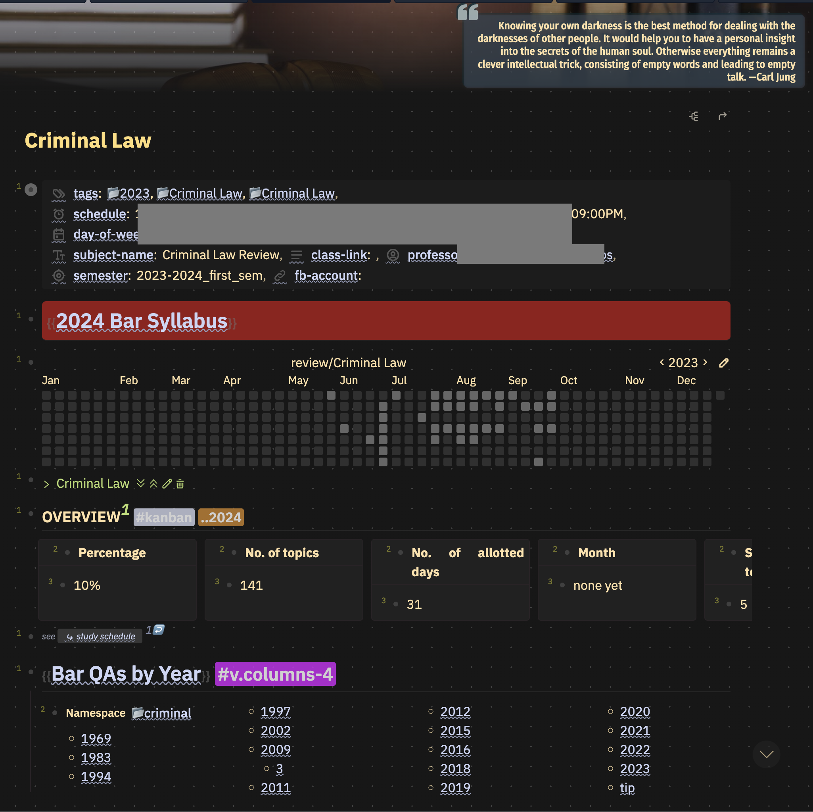
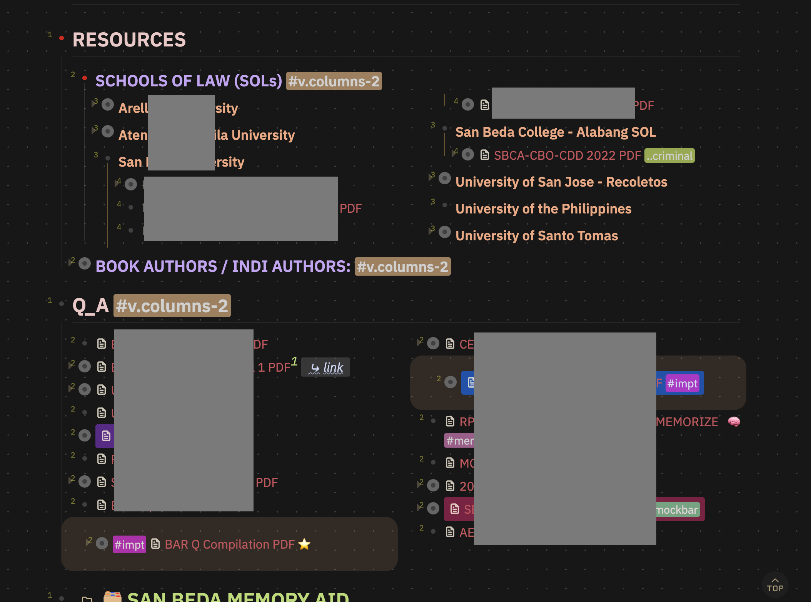

- **[15:04]** Few months ago, I already made this decision: `Kung moduol ang ang ting-bar, dislodge myself to SOSYAL MEDYAS.` It's not because some are toxic, but it is not helpful for me. `Pero I'll still log in from time to time, gihapon.` The only activity I might be engaged in is my Bar Chairman [compilation of MVLopez cases, which I plan to digest one case at a time on my own pace.](((6520ff11-2f8c-4251-b2a8-e3d1a660ccf7)))
- It's not because some are toxic, but it is not helpful for me. However, I'll still log in from time to time. The only activity I might be engaged in is my Bar Chairman's compilation of M.V. Lopez cases, which I plan to digest one case at a time on my own
- **[14:11]** There is no shortage of law review materials available to law students during their studies. However, the challenge lies in maximizing the benefits of these resources. Organizing them can be a daunting task. Fortunately, there are hidden treasures in the form of excellent lecture videos provided by review centers and law associations, such as PALS, that can be invaluable for law students. Personally, I can relate to feeling overwhelmed, especially during my second year in law school two (2) years ago. It was at that point that I recognized the significance of establishing an effective system to streamline my study workflow. That's when I discovered[Logseq]([[app/logseq]]) — an invaluable tool that has transformed my approach to organizing and accessing my study materials.
	- {:height 524, :width 407}
		- _{Fig. 1 Using logseq, this is how I organize my Criminal Law review subject as I do with other subjects.}
	- {:height 318, :width 403}
		- _{Fig. 2 Some of the law materials (Criminal Law) i found online and in FB group, again organizing the same with other subjects.}
			- As you can see, [I'm not innocent](((651ba20e-e398-4769-9522-a027348d601c))).