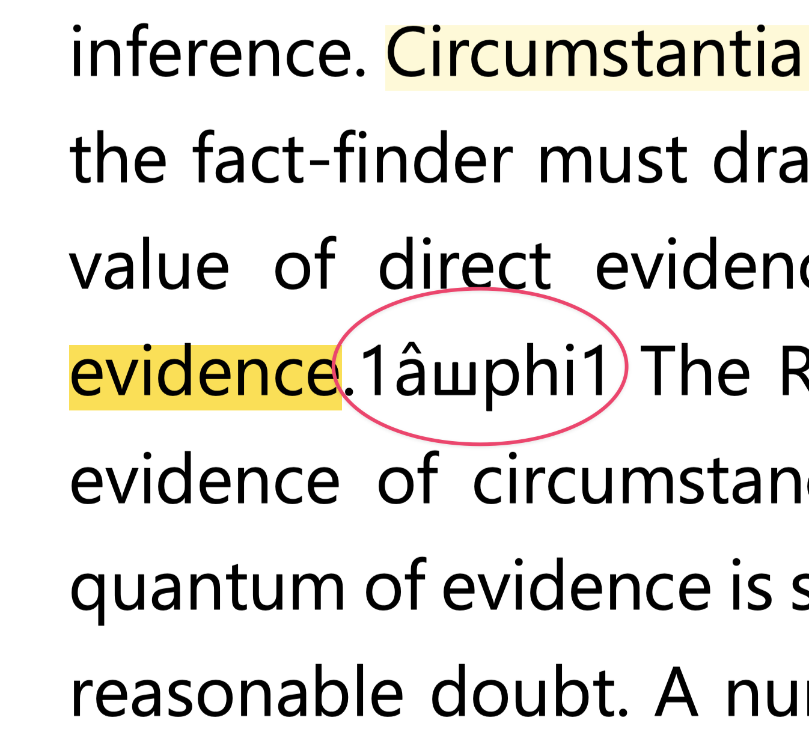

- #[[review/Remedial Law]]
	- **[19:59:21]** ((67ea5887-c6ca-407f-9662-e425cc4d2043))
		- TODO this coming [[Sunday, 06 April 2025]], bring ordinary affidavit (affidavit of loss) and judicial affidavit.
		  SCHEDULED: <2025-04-06 Sun>
		- > Mao ni among passport karong Sunday kay kung way passport? deport!
		- Sec. 3 and Sec 4 are important sections.
- **[18:26:30]** taronga sag copy/paste ue ;)
  collapsed:: true
	- {:height 529, :width 466}
	- {{embed ((6447bbd3-0e06-4e83-b44b-cb696d77ee6a))}}
- **[15:17:05]** posting here my #app/logseq Tutorials
	- Episode 1: Overview of Logseq DB (Database version)
		- <iframe src="https://www.facebook.com/plugins/video.php?height=340&href=https%3A%2F%2Fwww.facebook.com%2FCliffordEnocOfficial%2Fvideos%2F1188212866278145%2F&show_text=false&width=560&t=0" width="560" height="340" style="border:none;overflow:hidden" scrolling="no" frameborder="0" allowfullscreen="true" allow="autoplay; clipboard-write; encrypted-media; picture-in-picture; web-share" allowFullScreen="true"></iframe>
	- Episode 2: Creating Templates
		- <iframe src="https://www.facebook.com/plugins/video.php?height=314&href=https%3A%2F%2Fwww.facebook.com%2FCliffordEnocOfficial%2Fvideos%2F3062651337218305%2F&show_text=false&width=560&t=0" width="560" height="314" style="border:none;overflow:hidden" scrolling="no" frameborder="0" allowfullscreen="true" allow="autoplay; clipboard-write; encrypted-media; picture-in-picture; web-share" allowFullScreen="true"></iframe>
- **[14:26:59]** I am projecting that in the near (or far distant) future, Philippine judiciary (or Congress) will use `github-like` repository to manage public documents. It will be a game-changer.
- ### Review Materials
	- **[11:14:10]** Last January 2025, I availed UP BRIght Review Center's top-tiered review package. Alongside UP BRI, I also availed the full package offered from e-CODAL Plus. The latter is a supplement materials to the former.
		- These materials might propel me to pass the bar with high probability, but I did not take chances. I also availed Red-Gelo's 3-subject package for myself.
		- This acquisition of paid review materials could not have happen if I don't have the means and resources to buy them. This is a privilege that I cannot imagine years ago because I was then an A.S.P.O. — `anak sa pobreng ol*k.`
		- Anyway, I have to carry on and devour these "beasts."
			- 
			- ^{P.S. I respect their work so for those who wish to ask for a copy, don't.  Please respect their work and buy. Thank you.}