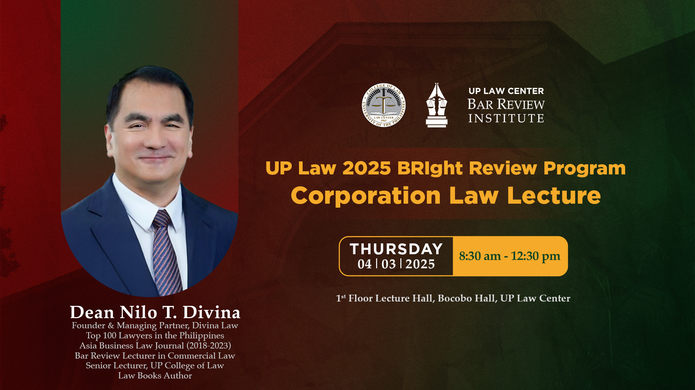

- **[15:43:06]** [[ROC_Annotated/PART_1/Rule 7]]
- Attending via Zoom atm
	- 
	- **[10:09:16]** break for 10 mins.
	- **[10:33:14]** observation/contemplation:
		- Few of the cases mentioned were also cited in my past Labor Law review. Is might be because Corporation law jurisprudence have elements of labor-related issues.
	- **[10:50:55]** February 23, 2021 is the period where a corporation to change/amend/fix the term of corporate existence expired. It based on the Revised Corporation Code's two-year compliance window from its 2019 effectivity. [*(for rerefence)*](https://x.com/i/grok/share/oHt5kAIUbj5e0GSZwEL7PcJcR)