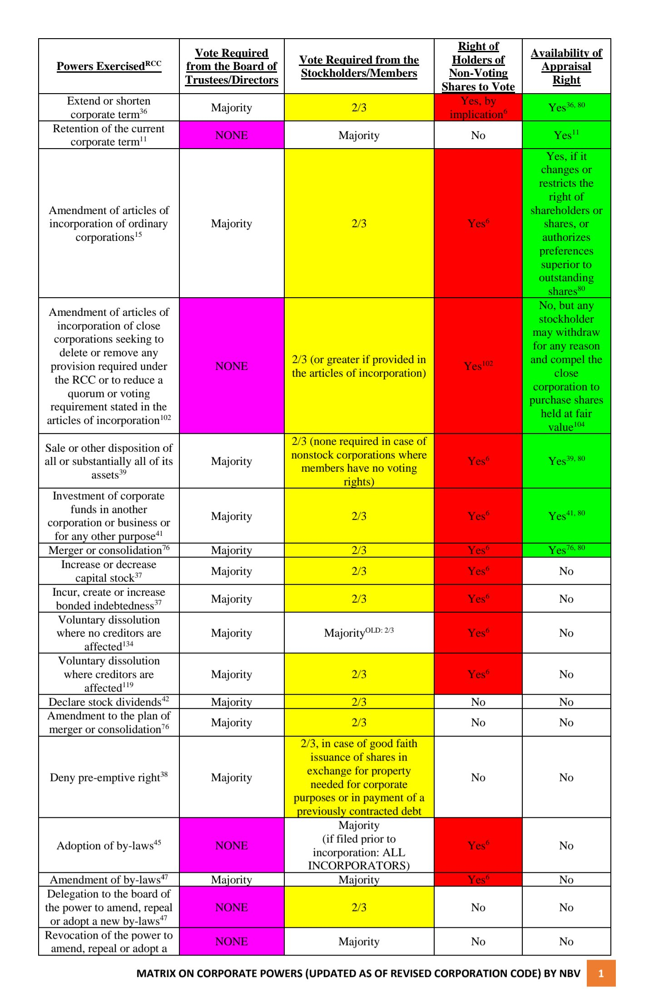
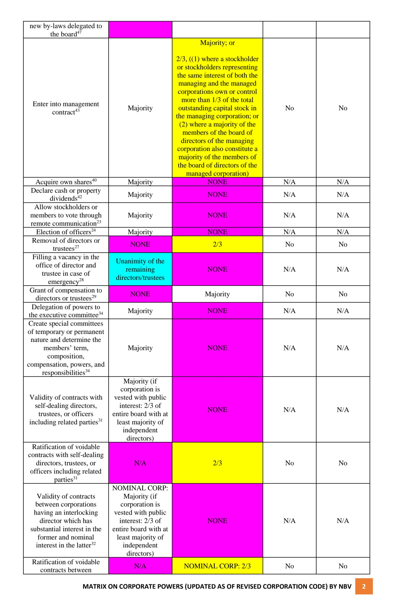
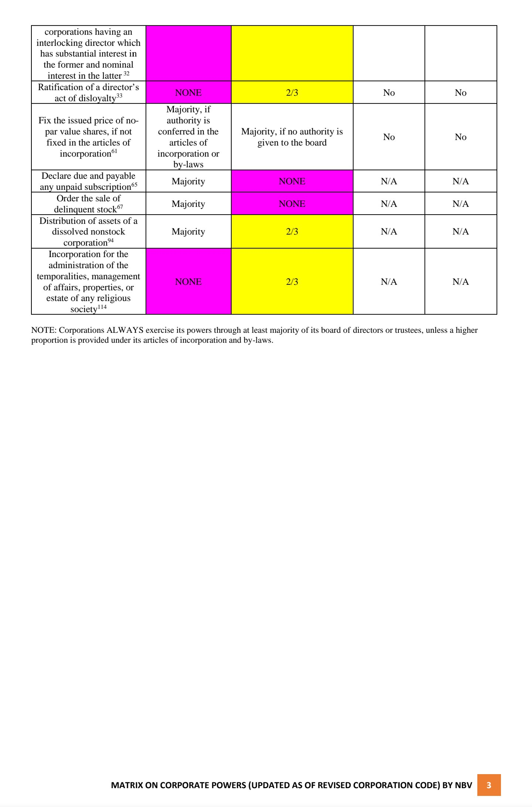
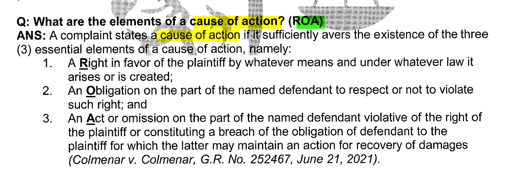
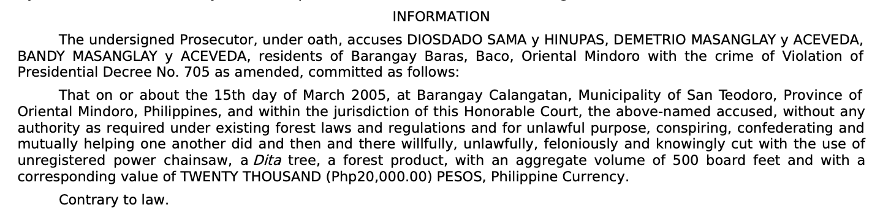
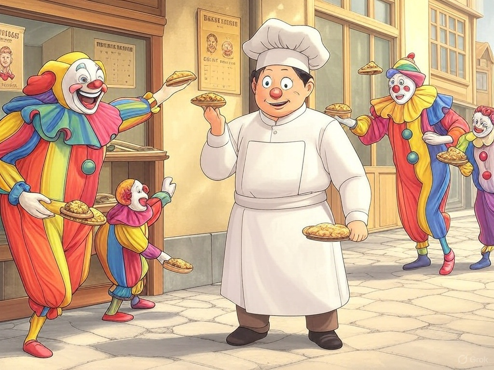
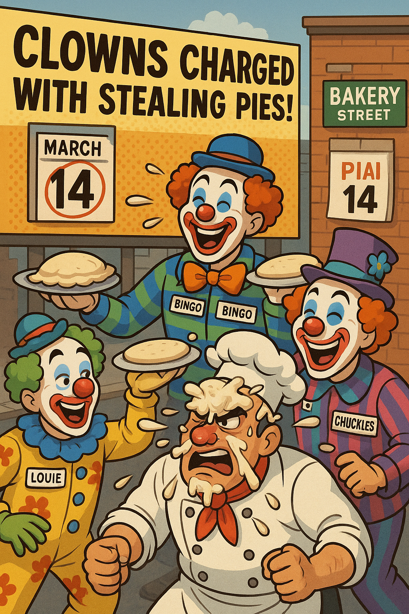
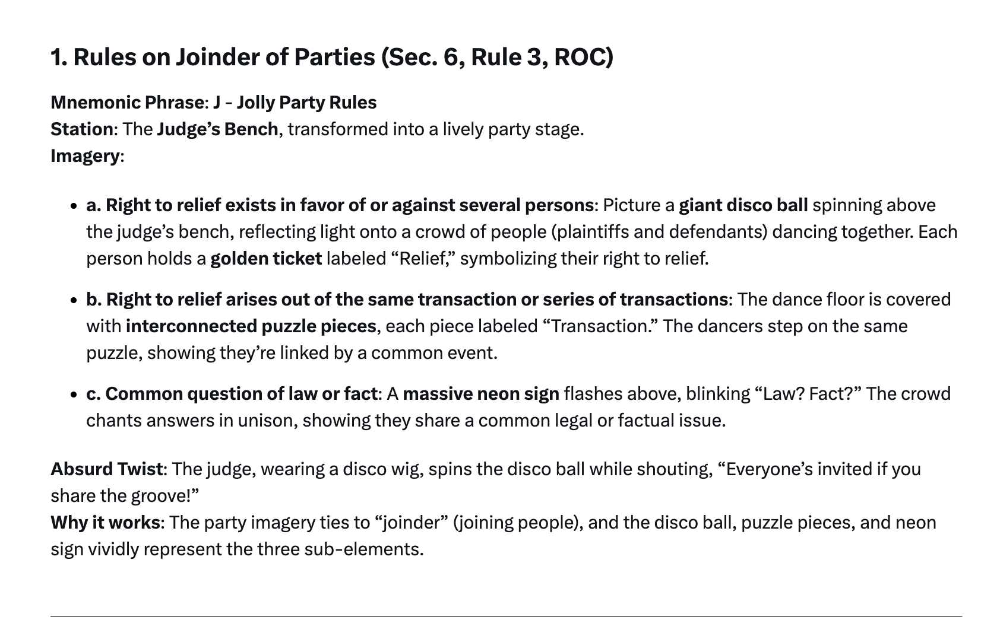
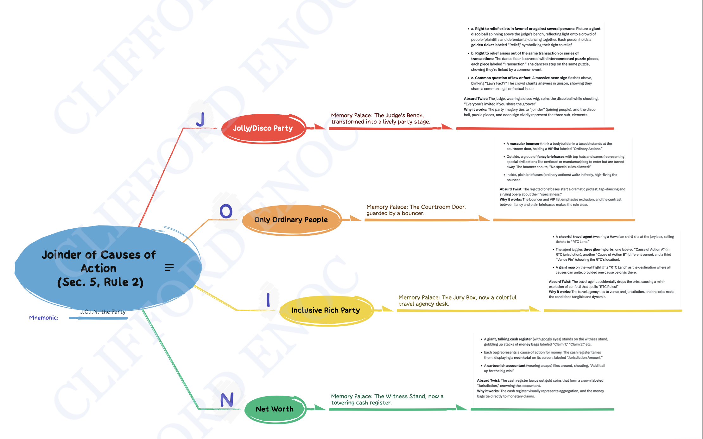

- **[23:15:49]** uploaded my `tldraw` notes for [[Special Writs]].
	- The note is unlike the native **Whiteboards** drawing where it was made inside this graph whereas this specific board (Special Writs) is just an `svg` file exported only from my local tldraw dev and pasted inside `Whiteboards.`
	- This is not optimal when viewed on the web because the svg file size is crazy heavy and huge (8Mb). Surely, using mobile devices to view this board will suffer.
		- > UPDATE: **[Sunday, April 20, 2025; 10:07:18]**
			- I deleted the board and transferred to [draw.io.](https://viewer.diagrams.net/?tags=%7B%7D&lightbox=1&highlight=0000ff&edit=_blank&layers=1&nav=1&title=law-review-remedial.drawio&dark=auto#Uhttps%3A%2F%2Fraw.githubusercontent.com%2Fcliffordx%2Flawdee%2Fmain%2Flaw-review-remedial.drawio)
- **[21:17:38]** [Revised Corporation Code]([[rccp]]) Matrix[^1]
  collapsed:: true
	- 
	- 
	- 
	- [^1]: _Source: Nico B. Valderrama [@nbvneverquits](twitter https://x.com/nbvneverquits/status/1784009587890467019)_
- **[18:56:36]** [[CONSTI_1987_Annotated/Article XIII (13)]]
	- ((6447bbbc-60f9-4373-92c5-bf176c7d836f)) #DHSUD ((6447bbbc-86f0-4c60-a3c1-f9097f343ce5))
		- Urban or rural poor dwellers shall not be evicted nor their dwellings demolished, except in accordance with law and in a just and humane manner.
		- No resettlement of urban or rural dwellers shall be undertaken without adequate consultation with them and the communities where they are to be relocated.
		- **For case reading:** Department of Public Works and Highways v. Manalo, G.R. No. 217656 (2020).
- **[12:22:50]** review of topics in [[BarSyllabus/2025/Remedial Law]]
	- ((67ea5888-7d6d-444a-bae9-3643f180eca2))
		- ((67ea5888-a029-4282-a8cf-0950c7290475))
			- ## 1. Elements of cause of action ROA #Mnemonic #[[cause of action]]
				- [[ROC_Annotated/PART_1/Rule 2]]
				  id:: 6803722a-6049-4add-b0b5-83609d4875f3
					- A cause of action is the act or omission by which a party violates a right of another. (n)
					- {:height 247, :width 688}[^1]
						- [^1]: _p. 35, Bedan Red Book Volume II Series of 2024_
					- For previous notes, [read this.](((67eaa9b6-a1f9-4a3d-985b-24b5e6bee72f)))
				- ## 2. Failure to state a cause of action
					- #### Distinction:
						- Failure to state a cause of action refers to the **insufficiency of the allegations in the pleading**, while lack of cause of action refers to the **insufficiency of the factual basis for the action.**[^1]
						- [^1]: _{*Department of Public Works and Highways v. Manalo, G.R. No. 217656 (2020).*}
						- So, there is no failure when there is sufficiency of the allegations in the complaint or pleading.
							- [Sec. 6, Rule 110, ROC](((d742018d-7771-4ceb-9973-333925020408)))
								- A complaint or information is sufficient if it states the name of the accused; the designation of the offense given by the statute; the acts or omissions complained of as constituting the offense; the name of the offended party; the approximate date of the commission of the offense; and the place where the offense was committed.
								- When an offense is committed by more than one person, all of them shall be included in the complaint or information.
								- ## Sample Information
									- [^1]
										- [^1]: _Hinupas v. People, G.R. No. 224469. January 5, 2021._
								- **Clowns Throwing Pies at a Baker on Bakery Street on Pi Day** #Mnemonic
									- ~~~~[^2]
									- [^3]
										- > A gang of clowns (wearing name tags so you know who they are) is gleefully throwing pies at a furious baker. This happens on a street with a big sign reading "Bakery Street", and in the background, there’s a calendar with March 14 (Pi Day) circled in red. Above the chaos, a giant headline on a billboard screams, "Clowns Charged with Stealing Pies!"
											- [^2]: Made with X/Grok 3 image generation.
											- [^3]: Made with ChatGPT image generation using the following prompt:
											  _A gang of clowns (wearing name tags so you know who they are) is gleefully throwing pies at a furious baker. This happens on a street with a big sign reading "Bakery Street", and in the background, there’s a calendar with March 14 (Pi Day) circled in red. Above the chaos, a giant headline on a billboard screams, "Clowns Charged with Stealing Pies!_
									- ***Here’s how this image maps to the six elements:***
									  collapsed:: true
										- Clowns: Represent the Accused. The gang of clowns implies multiple offenders, reminding you that all must be named if there’s more than one.
										- "Charged with Stealing Pies": This is the Designation of the offense, straight from the statute (think of it as the legal label for their crime).
										- Throwing pies: These are the Acts or omissions, the specific actions the clowns are accused of doing.
										- Baker: The Offended party, the poor victim covered in pie, clearly upset.
										- Pi Day (March 14): The Approximate date, a quirky, memorable date tied to pies (π = 3.14).
										- Bakery Street: The Place, a specific location where this pie-throwing crime went down.
									- ***Why It Works***
									  collapsed:: true
										- Absurdity: Clowns hurling pies at a baker is ridiculous and funny, making it stick in your mind.
										- Relatable Objects: Clowns, pies, a baker, a street sign, and a calendar are familiar but exaggerated here for effect.
										- Cohesive Story: The elements connect logically—clowns commit a pie-related crime against a baker at a specific time and place, with a clear charge.
										- No Strict Order: You don’t need to memorize a sequence; just picture the scene, and all six pieces fall into place.
									- **How to Use It**
									  collapsed:: true
										- When you need to recall the elements, visualize this scene: the clowns (Accused) throwing pies (Acts) at the baker (Offended) on Bakery Street (Place) on Pi Day (Date), charged with stealing pies (Designation). The image naturally prompts all six requirements.
									- ***Quick Recap with the Image***
									  collapsed:: true
										- Who’s accused? The clowns (Accused, multiple named).
										- What’s the charge? Stealing pies (Designation).
										- What did they do? Threw pies (Acts).
										- Who’s hurt? The baker (Offended).
										- When? Pi Day (Date).
										- Where? Bakery Street (Place).
					- #### Failure to state a cause of action
					  background-color:: yellow
						- must be filed at the earliest stage or before a responsive pleading is filed
						- immaterial if the allegation is true or false
						- preliminary objections raised by the defendant
					- #### Lack of cause of action
					  background-color:: red
						- Filed after the plaintiff rested its case
						- the judge shall determine the truth and falsity based on the evidence presented
						- raised as demurrer to evidence as a ground for insufficient of evidence
						-
				-
		- ((67ea5888-62c4-415a-b4f1-2b7055bf90cb))
			- x x x
			- ## 9. Misjoinder and non-joinder of parties and actions
			  collapsed:: true
				- ((67ea5887-d184-4cf3-9309-203a94928526))
				- ### Actions
				  collapsed:: true
					- [[ROC_Annotated/PART_1/Rule 2]]
						- {{embed ((6447bbc2-f822-4be7-bfbd-c1015a87b390))}}
						- {{embed ((6447bbc2-62ca-4e17-acb7-ce577a11717f))}}
							- > There is no sanction against `non-joinder` of separate causes of action.
							- **[14:02:09]** my ridiculous and/or absurd mnemonic for `Joinder of Causes of Action:` J.O.I.N. The Party.
								- ### The J Part only:
									- 
							- the Whole part of `J.O.I.N.` the Party #mnemonic
								-  [^1]
								- [^1]: _Made with XMind app and mnemonic concept produced from [Grok 3]({{https://x.com/i/grok/share/Wdg1TEXnsn2lcQaJQpHIyzBUb)._
				- ### Parties
				  collapsed:: true
					- [[ROC_Annotated/PART_1/Rule 3]]
					  collapsed:: true
						- {{embed ((6447bbc3-2379-4c95-bd2e-cf285ae244fd))}}
						- {{embed ((635f50a9-a8ed-4438-ab05-e4f74cf2cb55))}}
						- {{embed ((6447bbc3-5ed4-416c-9502-5a52df4600d7))}}
						-
			- ## 11. Suits against entities without juridical personality
				- ((6447bbc3-b125-40e3-a051-615cd7ad189f))
					- When two or more persons
					- **not** organized as an entity with juridical personality
					- enter into a transaction
					- they may be sued under the name by which they are generally or commonly known.
					- In the answer of such defendant
						- the names and addresses of the persons **composing said entity** must all be revealed.