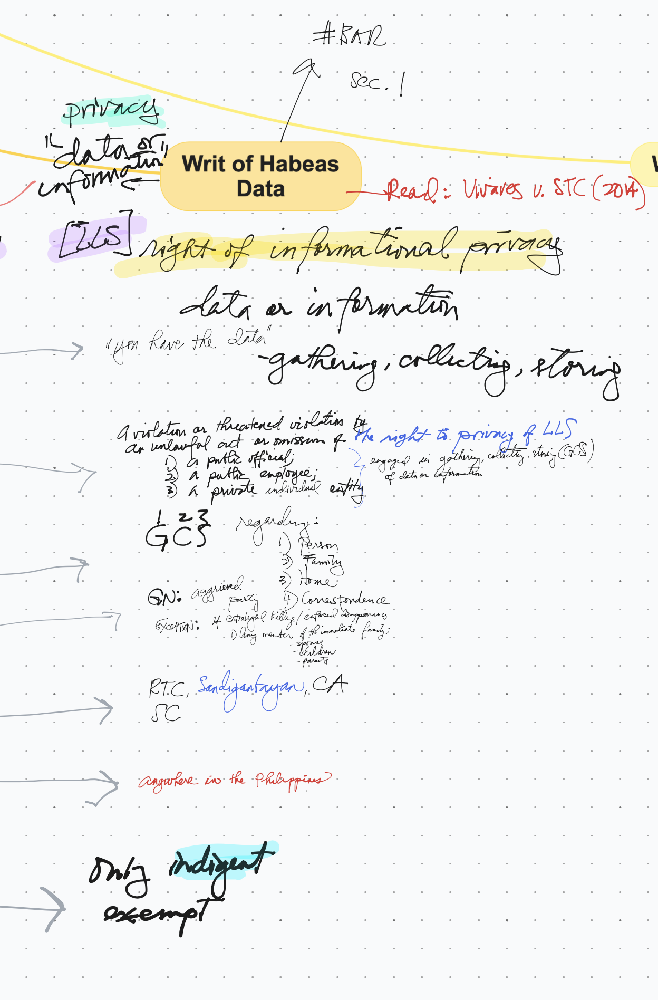
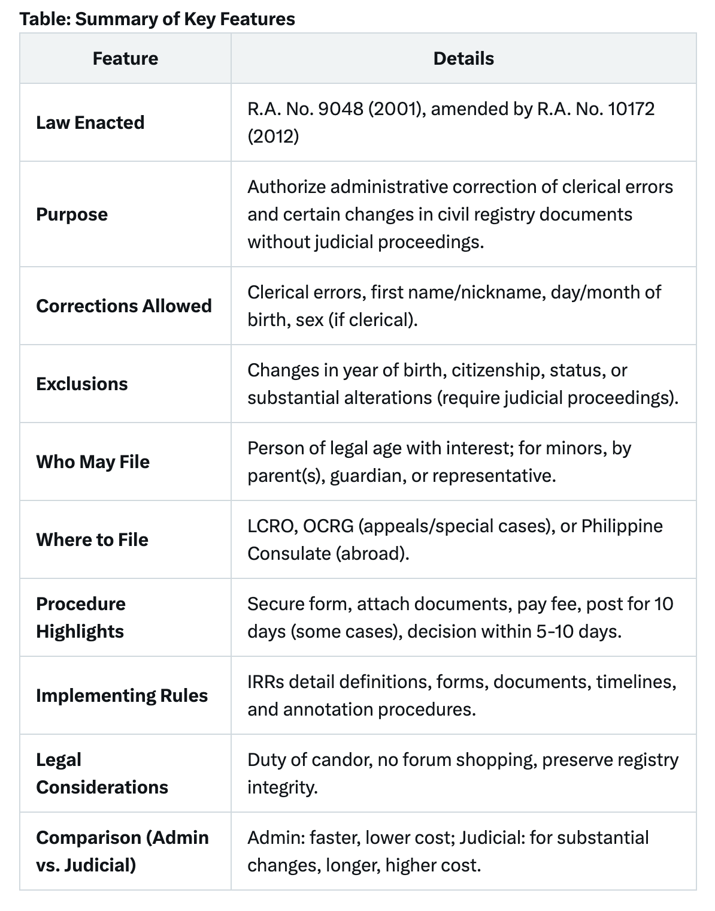
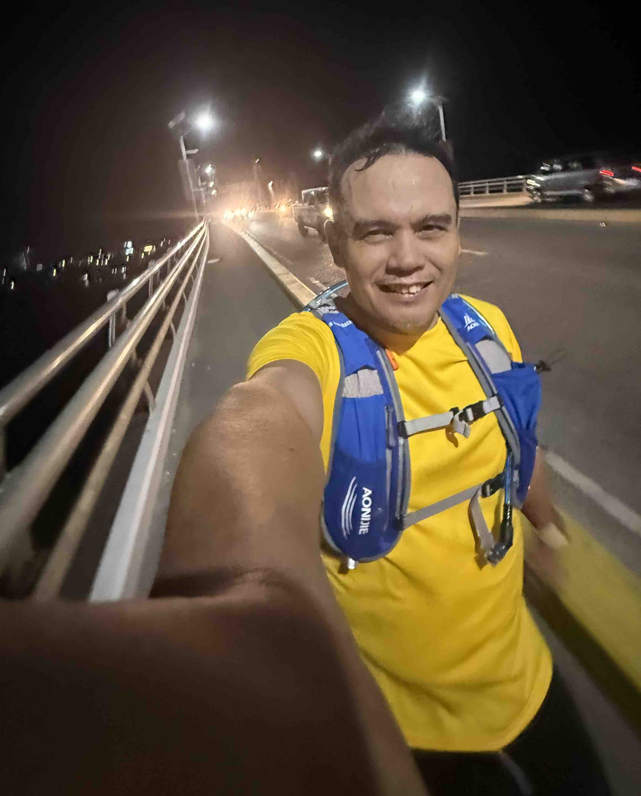
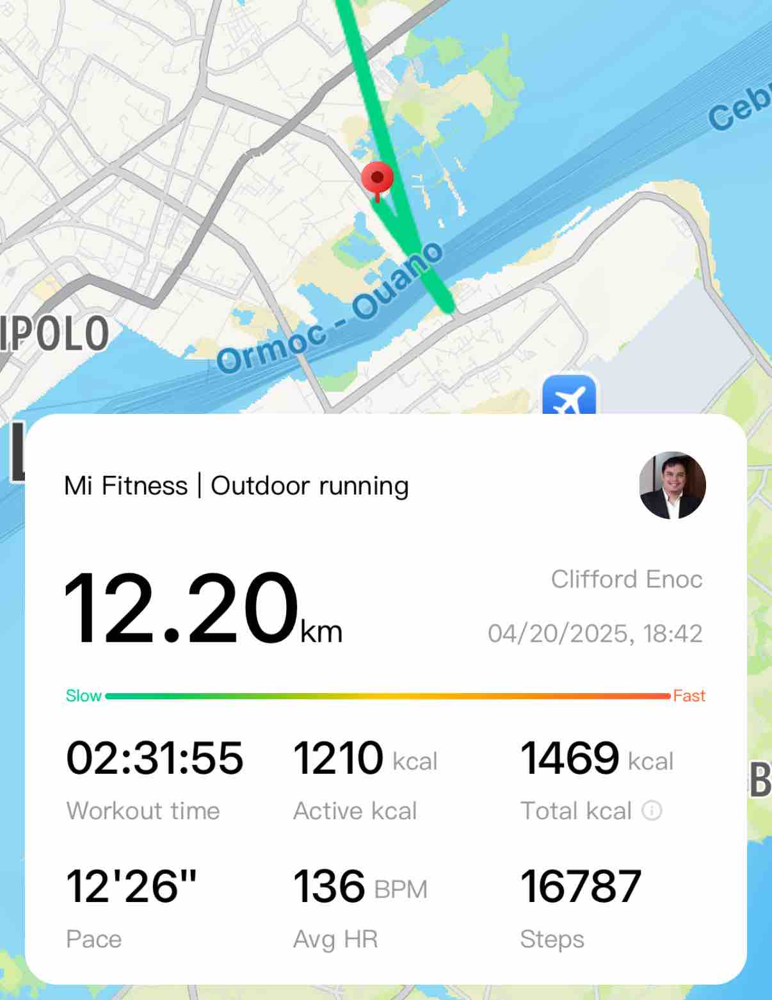

- Easter Sunday
- **[11:00:43]** Is the TV series [Better Call Saul]([[legal advice]]) worth watching? [I guess so](https://grok.com/share/c2hhcmQtMg%3D%3D_4ab9972e-2613-4917-8449-85b49e9738df).
	- After the `Breaking Bad` series, I did watch `Better Call Saul` but not the entire season of season 1. I am sure it's only few episodes and this was waaay before I enrolled and studied law.
	- *Better Call Saul* is around 2015ish. I enrolled at USJ-R School of Law around second semester of 2019 with only two (2) subjects: *Legal Ethics and Basic Logic(?).*
	- Ok. **[11:08:45]** Now re-watching Season 1:
		- Episode 1: `"UNO"`
			- Jimmy McGill, the protagonist-lawyer in this series has a brother, Charles "Chuck" McGill who were co-founder of HHN Law firm. He is broke. Jim too. Barely paid a parking ticket.
		- **[12:01:06]** E2:`Mijo`
			- They stumble on with a member of drug cartel when they ran their own elaborate scam when they tried to defraud Mijo's grandmother for money for that alleged `made-up` car-and-skateboard accident.
		- **[13:03:55]** E3: `Nacho`
		- **[14:58:45]** E4: `Hero`
			- "Upon this rock, I will build my church."
		- **[16:05:05]** S5: `Alpine Shepherd Boy`
		- **[17:23:15]** S6: `Five-O`
		- **[23:19:59]** S7: `Bingo`
		- [[Monday, 21 April 2025]] **[17:08:26]** S8: `RICO`
			- "You passed the bar?" — Chuck.
		- [[Tuesday, 22 April 2025]] **[14:26:27]** S9: `Pimento`
- **[14:32:36]** RemRev 2 synchronous class via Zoom
  collapsed:: true
	- Topic: Writ of Habeas Data
	- 
	- **[14:34:54]** Correction of Entries
		- > CLERICAL ERROR ACT AND ITS IMPLEMENTING RULES [R.A. NO. 9048, AS AMENDED BY **R.A. NO. 10172**
		- 
		- R.A. No. 9048, as amended by R.A. No. 10172, provides a vital administrative mechanism for correcting minor errors in civil registry documents, enhancing accessibility and efficiency. As of April 2025, no recent amendments or circulars have been identified, with the 2012 framework remaining current. This analysis ensures a thorough understanding for legal practitioners, petitioners, and researchers, emphasizing the law’s role in maintaining accurate civil records while respecting judicial boundaries for substantial changes. [(source)]({{twitter https://x.com/i/grok/share/1txMQaDOak6bKMulf46UdXd64}})
	- **[16:50:47]** Rule 108 Correction or Correction of Entries in the Civil Registry
		- #### Fujiki v. Marinay, G.R. No. 196049, June 26, 2013
		  background-color:: yellow
		- In the case of Minoru Fujiki v. Maria Paz Galela Marinay, the Supreme Court affirmed that a petition for the recognition of a foreign judgment affecting marriage status, like a divorce decree, can be pursued through a special proceeding for cancellation or correction of entries in the civil registry under Rule 108 of the Rules of Court. This rule allows for the correction of civil registry entries related to marriages, annulments, and judgments declaring marriages void. The court's decision in Fujiki v. Marinay specifically addressed the recognition of a foreign judgment declaring a bigamous marriage void and its effect on the Filipino spouse's civil registry.
		- **Rule 108 and Foreign Judgments:**
			- The case established that Rule 108 of the Rules of Court, which deals with the cancellation or correction of entries in the civil registry, can be used to recognize foreign judgments affecting marriage status.
		- **Recognition of Bigamous Marriage:**
			- The Supreme Court allowed Fujiki's petition for recognition of the Japanese Family Court's judgment declaring Marinay's marriage to Maekara void due to bigamy.
		- **Correction of Civil Registry:**
			- The ruling means that the foreign judgment can be used to correct entries in the civil registry in the Philippines, reflecting Marinay's true civil status.
	- **[17:34:56]** Distinction between Rule 103 and Rule 108 see p. 551, SPECIAL PROCEEDINGS, De Leon and Wilwayco, 2020 2nd edition. #⭐️/remedial
	- **[17:44:14]** Rule on Environmental Cases
		-
- **[18:20:26]** After class, I made a quick `slow run` towards LLC #health/running
	- {:height 608, :width 476}
		- ### `12K` run
		- {:height 688, :width 367}