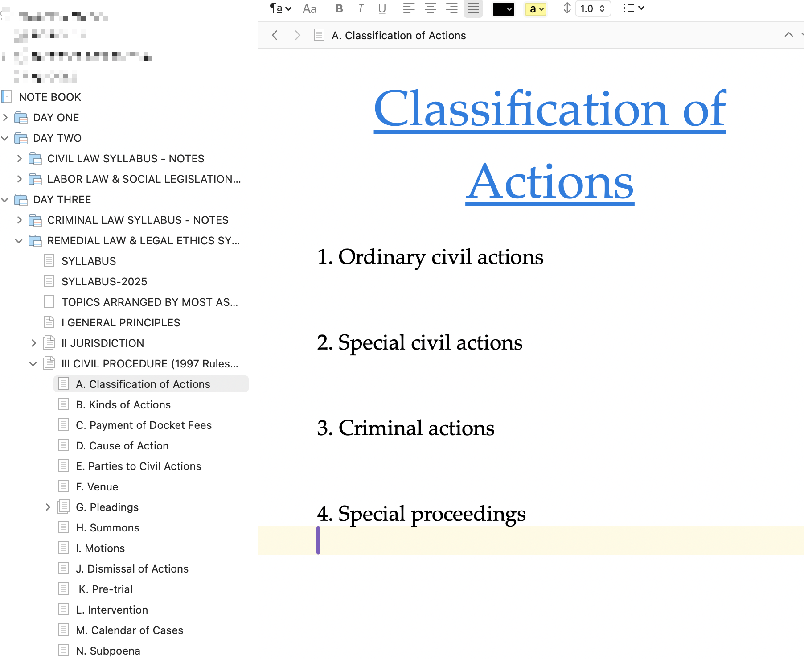

- **[14:24:06]** Jurisdiction of Sandiganbayan case reading: [Non v. Ombudsman](https://elibrary.judiciary.gov.ph/thebookshelf/showdocs/1/66528), G.R. No. 251177. September 08, 2020.
- **[14:07:34]** I am thinking about printing the [2025 Bar Syllabus]([[BarSyllabus/2025]]) for each subject and then supply only keywords, [mnemonic,]([[Mnemonic]]) or memorable provisions. Not only it is very compact and concise, I can even carry it prior to taking the bar inside the testing center. This could be my only companion as my last-minute tips (LMTs) readings.Good or bad?
	- 
- **[12:20:31]** *Timeline:* Interruption of prescriptive period of filing in court vs. filing in the Prosecutor's office
	- 
	- 