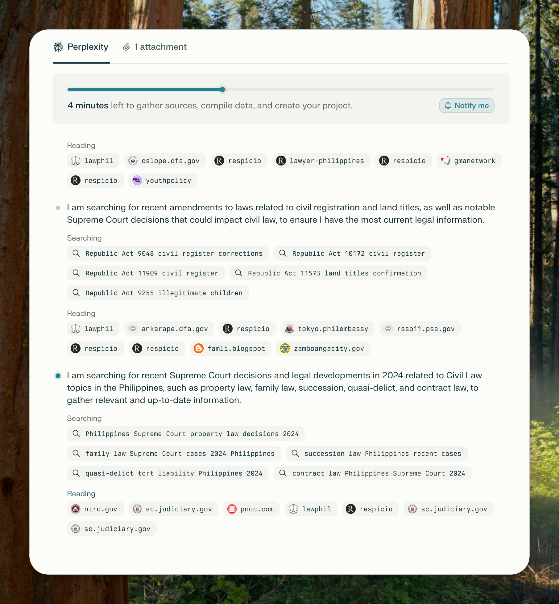
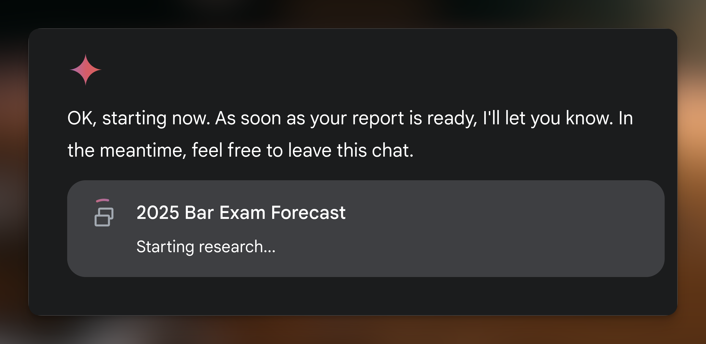
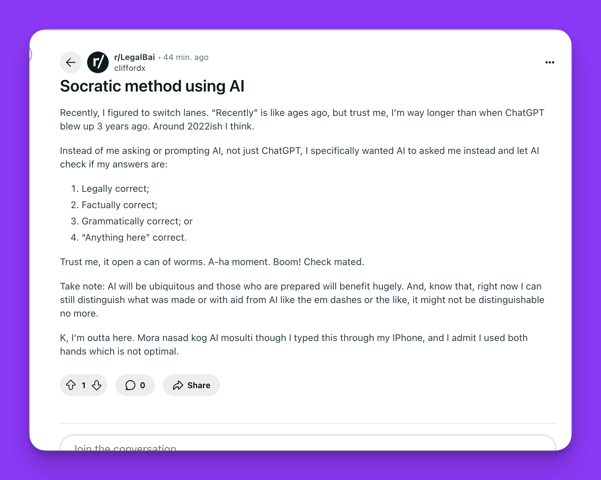

- **[14:40:04]** Extrapolation of data as regards Civil Law subject using "PPLX"
	- 
- **[13:15:12]** Abra-ca-dabra by "Gemma"
	- 
- Socratic Method using AI. Originally posted  at[r/legalbai](https://www.reddit.com/r/LegalBai/s/XkLyqB1l2n)
- {:width 627.5389404296875}
	- > Recently, I figured to switch lanes. “Recently” is like ages ago, but trust me, I’m way longer than when ChatGPT blew up 3 years ago. Around 2022ish I think.
	  >
	  > Instead of me asking or prompting AI, not just ChatGPT, I specifically wanted AI to asked me instead and let AI check if my answers are:
	  >
	  > 1.	⁠Legally correct;
	  2.	⁠Factually correct;
	  3.	⁠Grammatically correct; or
	  4.	⁠“Anything here” correct.
	  >
	  > Trust me, it open a can of worms. A-ha moment. Boom! Check mated.
	  >
	  > Take note: AI will be ubiquitous and those who are prepared will benefit hugely. And, know that, right now I can still distinguish what was made or with aid from AI like the `em dashes` or the like, it might not be distinguishable no more.
	  >
	  > K, I’m outta here. Mora nasad kog AI mosulti though I typed this through my IPhone, and I admit I used both hands which is not optimal.