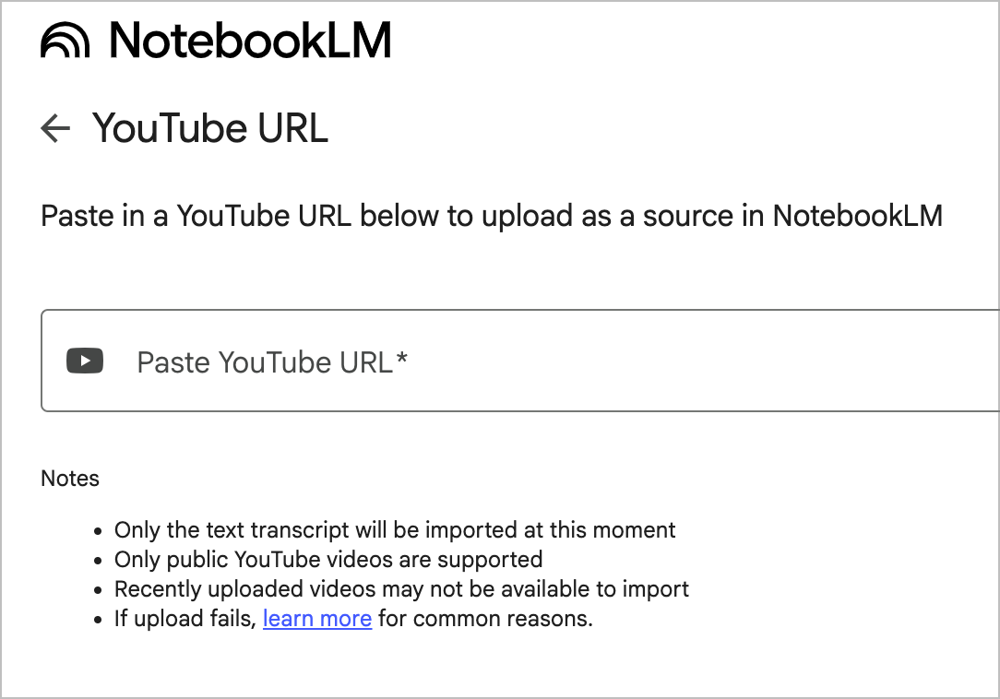
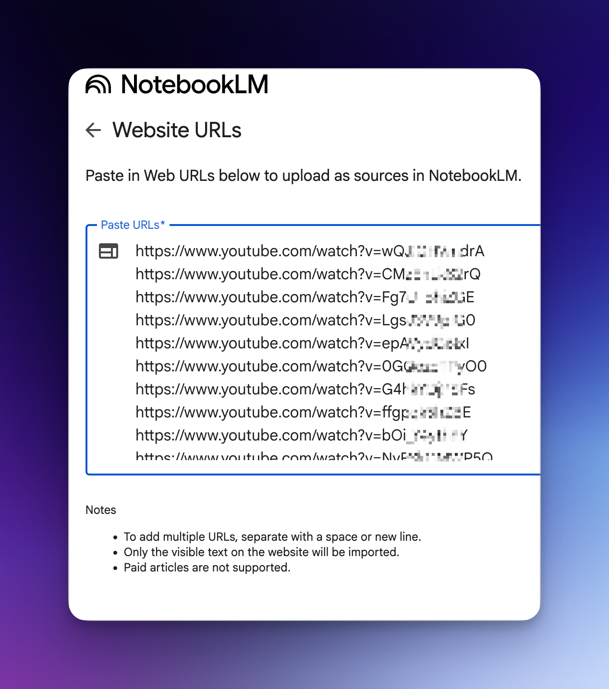
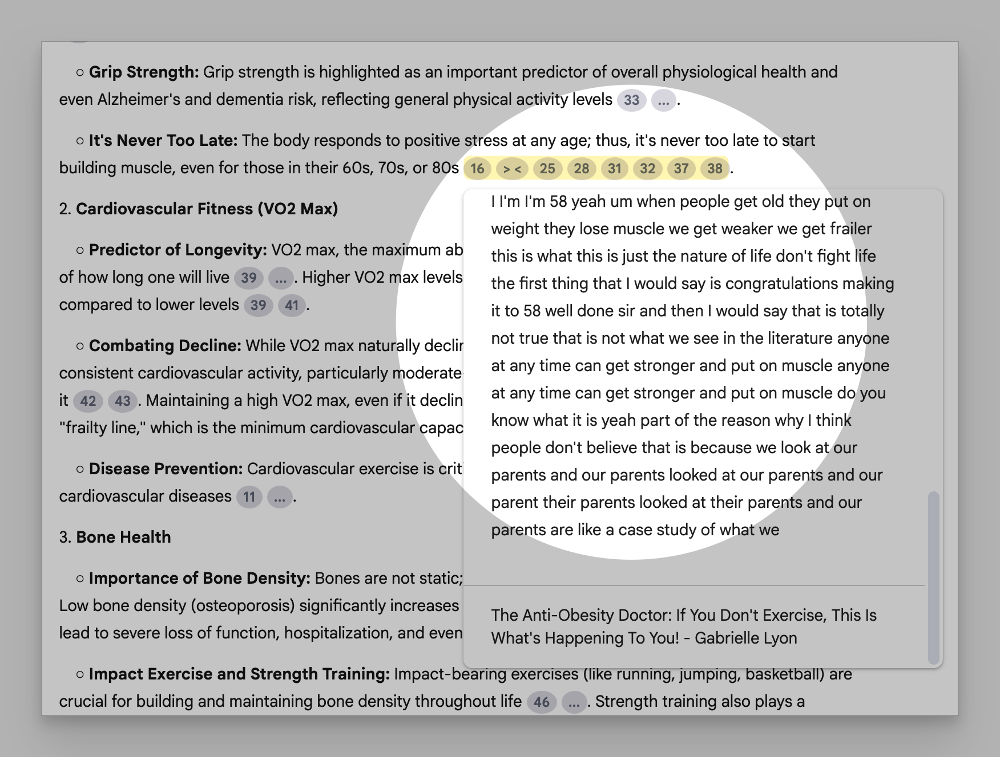

- **[12:18:30]** Important Tips from Bar Topnotchers about **Daily Rest and Sleep**:
	- Atty. Menchie Ona stresses "get enough sleep everyday! (at least 9 hours for me) Your brain processes info while sleeping".
	- Atty. John Paul Lim aimed for 8-12 hours of "pure studying" daily and usually went home by 9-11pm, freeing up weekends for minimal to no studying initially.
	- Atty. Eric David Tan prioritized "at least 6 hours of sleep".
	- Atty. Joan Mae To aimed for "at least 8 hours of sleep!".
	- Atty. Timothy Joseph Lumauig "never studied into the wee hours of the morning" to avoid burnout and prioritized sleep over cramming the night before exams.
	- Atty. Johana T. Sunga emphasizes getting "8 hours of sleep" and studying during "peak hours".
	- Atty. Raoul Angelo D. Atadero notes, "When you need to, nap. There’s no point studying when you’re sleepy" and "don’t force yourself to study when you can’t process or retain what you’re reading anyway".
	- Atty. Luz Danielle O. Bolong made "8 hours sleep... non-negotiable".
	- Atty. Irene Marie P. Qua, while cutting back on certain activities, did not eliminate them and stressed, "Rest. But, earn it".
	- Atty. Mae Diane Azores recommends "at least six to eight hours of sleep for your brain to work properly" and advises waking up early and going to bed early to take advantage of peak focus hours and train for exam days.
	- Atty. Bernice Pinol Rodriguez likewise states the importance of "get enough sleep night after night" because "if your brain is not going to be at its best so it's not worth it".
	- Czar Dayday, for his time, notes there was no social media or Netflix, reducing temptation for distraction. The 2023 topnotcher quoted by Bilyonaryo News Channel explicitly advises, "don't deprive yourself of breaks" to prevent burnout.
- **[10:20:24]** I found out that I can do this (see below), now then I can synthesize hundreds of Youtube videos under a playlist of my interest topics. Although NotebookLM allow up to 300 sources only per notebook, I can divide them into a separate Notebook. I thought about  this while I was in second year  law school Paksit33r. That was year 2023.
	- {:width 664.1705322265625}
	- **NOTE:** To import multiple youtube links, I use "Website" where I can just copy and paste one link per line.
	- 
- The final output:
	- 
- This is a screenshot how NotebookLM cite multiple sources. The only caveat is that I cannot get the source when trying to save Notes.
	- {:width 666.9111328125}
- Finally you might ask, *how to extract all those youtube links?* What I  was normally you do it manual by copying and pasting, BUT to automated and extract youtube links in a single playlist, it can be done easily with python:
	- ```python
	  import os
	  import argparse
	  from googleapiclient.discovery import build
	  from googleapiclient.errors import HttpError
	  
	  def get_playlist_videos(api_key, playlist_id):
	      try:
	          youtube = build('youtube', 'v3', developerKey=api_key)
	          videos = []
	          next_page_token = None
	  
	          while True:
	              request = youtube.playlistItems().list(
	                  part="snippet",
	                  playlistId=playlist_id,
	                  maxResults=50,
	                  pageToken=next_page_token
	              )
	              response = request.execute()
	              
	              for item in response['items']:
	                  video_id = item['snippet']['resourceId']['videoId']
	                  videos.append(f"https://www.youtube.com/watch?v={video_id}")
	              
	              next_page_token = response.get('nextPageToken')
	              if not next_page_token:
	                  break
	  
	          return videos
	      except HttpError as e:
	          print(f"\n❌ YouTube API Error: {e}")
	          print("Possible reasons:")
	          print("- Invalid API key")
	          print("- Incorrect playlist ID")
	          print("- API quota exceeded")
	          exit(1)
	      except Exception as e:
	          print(f"\n⚠️ Unexpected error: {e}")
	          exit(1)
	  
	  def save_to_file(videos, filename):
	      with open(filename, 'w') as f:
	          for video in videos:
	              f.write(video + '\n')
	  
	  if __name__ == "__main__":
	      parser = argparse.ArgumentParser(description='Extract YouTube playlist links')
	      parser.add_argument('--api-key', required=True, help='YouTube Data API Key')
	      parser.add_argument('--playlist', required=True, help='Playlist ID or URL')
	      parser.add_argument('--output', default='playlist_links.txt', help='Output filename')
	      args = parser.parse_args()
	  
	      # Extract playlist ID from URL if needed
	      playlist_id = args.playlist
	      if "youtube.com" in playlist_id or "youtu.be" in playlist_id:
	          if "list=" in playlist_id:
	              playlist_id = playlist_id.split("list=")[-1].split("&")[0]
	          elif "/playlist/" in playlist_id:
	              playlist_id = playlist_id.split("/playlist/")[-1].split("/")[0]
	      
	      print(f"🔍 Extracting videos from playlist: {playlist_id}")
	      try:
	          video_links = get_playlist_videos(args.api_key, playlist_id)
	          save_to_file(video_links, args.output)
	          print(f"✅ Success! Saved {len(video_links)} links to {args.output}")
	      except Exception as e:
	          print(f"❌ Extraction failed: {e}")
	  
	  ```
	- Then on terminal or command prompt:
	- ```text
	  python playlist_extractor.py --api-key API_KEY --playlist PLAYLIST_ID --output youtube_playlist_[NAME].txt
	  ```
	- What I need  is a Youtube api v3 at Google Studio. For this part, If you want to go this route, you need research how to get to an api from Youtube.
		- — The Paksiteer **[10:53:17]**