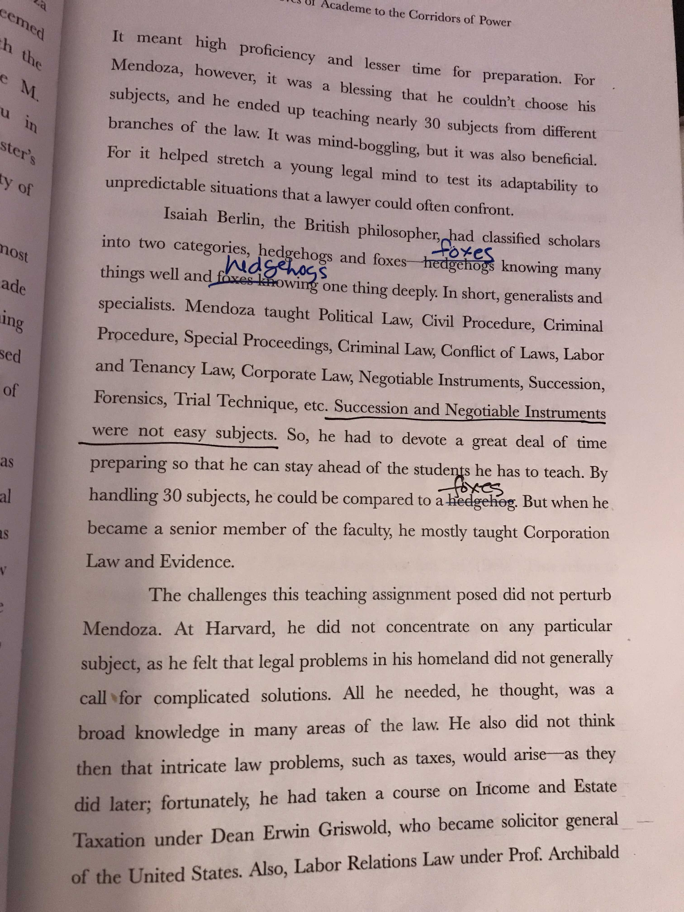

- Here's the thing. When I publish my [[graph]] here, sometimes or often there are typos, that's a given and I sometimes missed it but mostly I double check but you can't be sure.
- If you can help me out, thank you and [reach out to me here](((de1311b9-7141-4a55-950c-2ffe17d350c0))) or send an email to `cresupport@gmail.com.`
- Typos and specially wrong grammar are annoying right? I can relate because I got annoyed myself too but when it comes to my own grammar? Hahaha, I suck.
- So help me make me a better "grammar nazi," deal?
- Below is a screenshot of what I learned when you are reading critically. It is not a typo (though there are lot throughout the book) but an [anthropomorphism](https://www.collinsdictionary.com/us/dictionary/english/anthropomorphism) where the animals were interchanged. (*Read* [Explanation](https://en.wikipedia.org/wiki/The_Hedgehog_and_the_Fox))
- I'm not bashing the author, perhaps it got lost on the press or the editor was lazy, or paid less.
- 
- if you happen to know which book this is, it's from the book, "Forester of Nations The Last Resort" page 65 of Chapter Two: From The Groves of Academe To the Corridors of Power. It's a good book I recommend it. There are typos throughout the book but I can live it with it. How about you?
- So there's that.
- Thanks for reading.