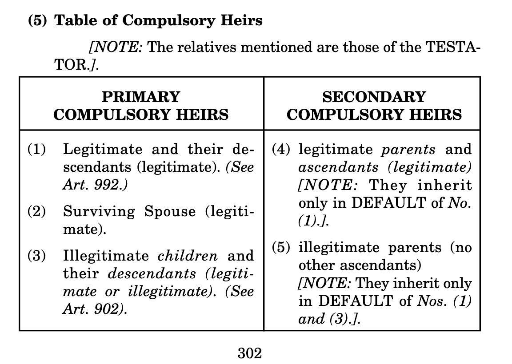

- # Blacks Law
	- **Heir:**  (air). (13c)
	- collapsed:: true
	  1. Someone who, under the laws of intestacy, is entitled to receive an intestate decedent’s property. — Also termed/called legal heir, heir at law, lawful heir, heir general; legitimate heir. Cf. ANCESTOR.[^bl]
		- [^bl]: _{Garner, Bryan A., and Henry Campbell Black, eds. *Black’s Law Dictionary*. Eleventh edition. St. Paul, MN: Thomson Reuters, 2019., p. 869.}
		- > "Laymen — and sometimes first-year law students taking exams — wrongly assume that one who receives real property by will is an heir. Technically, the word ‘heir’ is reserved for one who receives real property by action of the laws of intestacy, which operate today only in the absence of a valid will." ^{Thomas F. Bergin & Paul G. Haskell, Preface to Estates in Land and Future Interests 14 n.32 (2d ed. 1984)}
	- In common-law jurisdictions, a person who inherits real or personal property, whether by will or by intestate succession; esp., by abstract designation, someone who serves merely to determine the quantity of an estate given by will.
	  collapsed:: true
		- > "Of the operation of the terms 'heirs’ and ‘heirs of the body,’ In a will, or other instrument of conveyance. The general rule is, that those terms do not denote any particular person, to take by way of description, as devisee, grantee, or donee. Neither does any estate, by the use of those terms, vest in any person in character of heir; but only in the person of him who is named In the instrument of conveyance, who takes by purchase. But the heirs there named do not take as purchasers. They are words merely descriptive of the quantity of the estate given: As, if an estate Is devised to A, and his heirs, forever; In this case, A alone takes the estate as a purchaser; and the terms, his heirs forever, denote what estate is limited by the devisee to A, *viz.,* a fee simple, wholly in his power to alien or dispose of, as he pleases; and is, upon his death, descendible to dispose of, as he pleases; and is. upon his death, descendible to his heirs in general. If it be devised to A. and the heirs of his body, this denotes the estate to be an estate tail, descendible to no other heirs but to those of his body They serve, then, not as a designation of any person who is to take the estate, but only as descriptive of the quantity of the estate taken by the devisee."^{Tapping Reeve, The Low of Baron and Femme 60 (1862)}
	- Popularly, a person who has inherited or is in line to inherit great wealth.
	- *Civil law.* **^^Someone who succeeds to the rights and occupies the place of, or is entitled to succeed to the estate of a decedent, whether by an act of the decedent or by operation of law^^**. The term *heir* under the civil law has a more expansive meaning than under the common law.
- # Different classes of heirs:
  id:: 6357bf07-4204-4d58-a767-9dc6d7950092
  background-color:: red
	- There are in general three classes of heirs; voluntary, legal or intestate, and compulsory.
		- 1. **Voluntary heirs** are those called upon to succeed by virtue of the will of a person expressed in his last will and testament.
		- 2. **Legal or intestate heirs** are those called to succeed by operation of law.
		- 3. ((63575738-b48f-4a77-8be9-43280a8f6fb1)) However, due to the changes brought about by the Family Code, the following are considered as compulsory heirs:
			- a. Legitimate children and legitimate descendants as to the legitimate parents and legitimate ascendants.
			- b. In default of the legitimate children, legitimate parents and ascendants as to the legitimate children and descendants
			- c. Surviving spouse
			- d. Illegitimate children
			- e. Illegitimate parents as to the illegitimate children without issue
			- f. Adopted children, for all civil purposes are considered as legitimate children under the Family Code. *Read* BARITUA v. CA 183 SCRA 565.
- # Compulsory Heirs
  id:: 635756d0-02d4-43fe-84d7-2668de85b297
  background-color:: red
	- In general, compulsory heirs are those heirs for whom the law has reserved that part of the testator’s estate known as the legitime.[Art. 886](((634fba6d-78b7-4ce7-a959-dce0556783d5))) As such, testator cannot disregard them.
	- # Kinds/Classes of Compulsory Heirs
	  id:: 63575a0e-3348-4ac4-a7bf-79af6d8bec62
	  background-color:: blue
		- The compulsory heirs as [enumerated in Art. 887](((63575738-b48f-4a77-8be9-43280a8f6fb1))) may be classified into **primary compulsory heirs** and **secondary compulsory heirs.**
		- (There may be also the concurring compulsory heirs as it will be explained later.)
		- Primary compulsory heirs are those who are always entitled to their legitime as provided by law regardless of the class of compulsory heirs with which they may concur, while secondary compulsory heirs are those who may be excluded by other compulsory heirs.
		- The first includes all kinds of compulsory heirs with the exception of parents or ascendants, while the second embraces only parents or ascendants.
		- ### Primary Compulsory Heirs
			- The primary compulsory heirs get their legitime even in the presence of the other primary compulsory heirs and even in the presence of the secondary compulsory heirs. The primary forced heirs are those mentioned in Nos. 1, 3, 4, and 5, Art.887. Note that the illegitimate children, to be compulsory heirs, must be recognized.
			- Natural children, *who have not been voluntarily recognized or acknowledged* should be regarded as LEGITIMATED in case their parents will have a subsequent valid marriage. This is particularly true if said children had enjoyed the continuous possession of the status of acknowledged natural children by direct acts of the parents or the members of the family. Estoppel should prevent the family from questioning the status. Besides, technicality should give way. The said children will therefore be allowed to inherit.
			- > *NOTE:* There is no more distinction between the natural and spurious children under the Civil Code. (See Art. 165, Family Code).
		- ### Secondary Compulsory Heirs
			- The secondary compulsory heirs are those mentioned in [No. 2 in Art. 887](((635a9ef6-b491-493d-983d-b9255566e327))). They inherit only in the absence of [No. 1 in Art. 887](((635a9ef6-8910-424a-a0e3-13d0da39bd3e))). The father or the mother of illegitimate children is also a secondary compulsory heir but only as provided for in [Art. 903](((634fba6c-299a-40f2-93e6-2c1226a1ef4a))).
	- ## TABLE OF COMPULSORY HEIRS
		- 
- **Compulsory heirs are those enumerated in Art. 887 of the Civil Code.**
  id:: 63575738-b48f-4a77-8be9-43280a8f6fb1
  collapsed:: true
	- If the testator is a **legitimate person**, his compulsory heirs under Art. 887 of the Civil Code are the following:
	  background-color:: red
		- (1) ((63576df1-7a13-404d-bf30-339d839fe080))
		  collapsed:: true
			- This class includes legitimate children or descendants proper[^8] legitimated children or descendants,[^9] and adopted children.[^10]
			- As a rule, adopted children are entitled to the same successional rights as legitimate children.^{*Ibid.*}
			- **There are, however, two well-known exceptions.** Thus, if the adopter is survived by his legitimate parents or ascendants and by his adopted child, the latter shall not have more successional rights than an acknowledged natural child.^{*Ibid.*} Furthermore, if the adopter dies before his legitimate parent or ascendant, or is incapacitated to inherit from such parent or ascendant, or is disinherited by such parent or ascendant, unlike a legitimate child, the adopted child cannot inherit by right of representation from the parent or ascendant.
			- *The basis of this exception is evident.*
			- [[#blue]]==Adoption merely creates a relationship similar to that of legitimate paternity and filiation between adopter and adopted child. It does not create any relationship between the adopted child and the legitimate relatives of the adopter.==
				- [^8]: Article [264](((634fba6a-78a8-43ee-825e-13470307265a))), Civil Code.
				- [^9]: Article [272](((634fba6a-1b42-415d-a537-5dd73eee5624))), Civil Code.
				- [^10]: _{See Art. 39, Child and Youth Welfare Code (P.D. No. 603).}
		- (2) In default of the foregoing, legitimate parents and ascendants;
		  collapsed:: true
			- **Legitimate parents or ascendants are classified as secondary compulsory heirs** ^^because of the fact that under our law, they cannot inherit from their child or descendant if they concur with legitimate children or descendants of the latter. It must be noted, however, that while they can be excluded by the presence of legitimate children or descendants, they cannot be excluded by the presence of adopted children.^^
			- This is so, because of the provision of No. 4 of Art 39 of the Child and Youth Welfare Code (P.D. No. 603), which has superseded Art. 343 of the New Civil Code, and which states that if the adopter is survived by legitimate parents or ascendants and by the adopted child, the latter shall not have more successional rights than an acknowledged natural child.
			- Illegitimate parents are also classified as secondary, compulsory heirs because of the fact that under our law, they cannot inherit from their illegitimate child if they concur with children or descendants of the latter, whether legitimate or illegitimate. Thus, [if the testator, who is an illegitimate child](((63575771-fec9-49d8-8da2-0e90934ebc5a))), is survived by his children and his illegitimate parents, the latter are excluded altogether from the succession by the presence of the former regardless of their legitimacy or illegitimacy.
			- ***If the testator happens to be an adopted person, may the adopter also be classified as a secondary compulsory heir?***
			- So long as the adopted person is survived by his parents by nature, whether legitimate or illegitimate, the adopter cannot be classified as a secondary compulsory heir. There is, however, an instance where he may be classified as such.
			- According to the last paragraph of No. 4 of Art. 39 of the Child and Youth Welfare Code (P.D. No. 603):
				- > “The adopter shall not be a legal heir of the adopted per-
				  son, whose parents by nature shall inherit from him, except that if the latter are both dead, the adopting parent or parents take the place of the natural parents in the line of succession.”
			- Although the law uses the term “legal heir,” nevertheless, because of the qualifying phrase “whether testate or intestate” at the end of the provision, it is evident that it also refers to compulsory heirs.
			- #admon-quote (Note: The abovequoted provision of the Child and Youth Welfare Code is an example of very bad codification. Suppose that the testator is an adopted person, and he is survived by his legitimate grandparents and the adopter, *what will happen then? Shall the grandparents be excluded?* Unfortunately, the law is explicit, too explicit as a matter of fact. The adopter shall take the place of the deceased parents of the testator in the line of succession. That means that the grandparents shall be excluded. Only the adopter shall be classified as a compulsory heir of the adopted. He shall, therefore, be entitled to a legitime of one-half (1/2) of the entire estate of the adopted. This is clearly unjust.)
			- Under [Art. 190](((634fbac3-822c-46c4-998c-3261d2fe289b))) of the Family Code, when parents (legitimate or illegitimate), or the legitimate ascendants of the adopted concur with the adopters, they shall divide the entire estate, that is, one-half to be inherited by the parents or ascendants and the other half by the adopters.
				- #### PROBLEM
					- Don died after executing a Last Will and Testament leaving his estate valued at P12 Million to his common-law wife Roshelle.
					- He is survived by his brother, Ronnie and his half-sister Michelle.
					- *1. Was Don’s testamentary disposition of his estate in accordance with the law on succession? Explain your answer.*
					- *2. Assuming further that he died intestate, survived by his father Juan, his brother Ronie, his half-sister Michelle and his legitimate son Jayson. How will you distribute his estate? Explain.*
					- #### Answer
						- 1. Yes. Don’s testamentary disposition of his estate is in accordance with the law on succession. Don has no compulsory heirs not having ascendants, descendants nor a spouse (Art. 887, NCC). Brothers and sisters are not compulsory heirs. Thus, he can bequeath his entire estate to anyone who is not otherwise incapacitated to inherit from him. A common-law wife is not incapacitated under the law as Don is not married to anyone.
						  2. Jayson will still be entitled to the entire P12 Million as the father, brother and sister will be excluded by a legitimate son of the decedent (Art. 887, NCC). This follows the principle that the descendants exclude the ascendants from inheritance.^{(Suggested Answers to the 2006 Bar Examination Questions, PALS)}
		- (3) The widow or widower;
		  collapsed:: true
			- Under the old law, the widow or widower was entitled merely to a usufructuary right; under the present law, she or he is now entitled to all of the rights of a primary compulsory heir. However, if there is a decree of legal separation, the guilty spouse can no longer be considered as a compulsory heir of the innocent spouse, since one of the effects of the decree is to disqualify the former from inheriting from the latter.[^13]
				- [^13]: Arts. [106](((634fba69-b6b0-4bcd-905e-53f5979dbceb))), [892](((634fba6c-d424-4806-bcf5-68611e4f3117))), Civil Code.
			- **The surviving spouse cannot claim to be a compulsory heir of her or his parent-in-law under Art. 887(3).** The aforesaid provision refers to the estate of the deceased spouse in which case the surviving spouse (widow or widower) is a compulsory heir. It does not apply to the estate of a parent-in-law.
		- (4) Acknowledged natural children and natural children by legal fiction; and (*Read:* ((635757a3-50f5-4e27-a3f2-5b43e7c64af0)))
		- (5) Acknowledged illegitimate children who are not natural. (*Read:* ((635757a3-50f5-4e27-a3f2-5b43e7c64af0)))
	- On the other hand, if the testator is **an illegitimate person**, his compulsory heirs are the following:
	  background-color:: blue
	  id:: 63575771-fec9-49d8-8da2-0e90934ebc5a
		- (1) Legitimate children and descendants;
		- (2) Acknowledged natural children and natural children by legal fiction; (*Read:* ((635757a3-50f5-4e27-a3f2-5b43e7c64af0)))
		- (3) Acknowledged illegitimate children who are not natural; (*Read:* ((635757a3-50f5-4e27-a3f2-5b43e7c64af0)))
		- (4) In default of all the foregoing, parents by nature; and
		- (5) The widow or widower.
	- ((63575ab4-0e81-4f66-81ba-20587331c09a))
	  id:: 635757a3-50f5-4e27-a3f2-5b43e7c64af0
		- ### [[#red]]==Under the New Civil Code==
		  collapsed:: true
			- There are **three kinds of illegitimate children** under the Civil Code who are classified as primary compulsory heirs.
				- **They are:**
					- (1) acknowledged natural children;
					  collapsed:: true
						- These includes all natural children who may have been acknowledged either voluntarily[^15] or by a final judgment of a competent court.[^16] Consequently, *a natural child who has not been acknowledged is not a compulsory heir.* In other words, in relation to his presumed parent, he has no successional right whatsoever. This is the settled rule in this jurisdiction.[^17] It is, however, possible that even when the testator is already dead, a natural child not acknowledged may still participate in the inheritance by maintaining a complex action to compel recognition and at the same time to obtain relief in the character of heir.[^18] But such an action would be possible only in those exceptional cases provided by law.[^19]
							- [^15]: [Art. 278](((634fba6a-efc1-4aee-b979-7e969df09b2a))), Civil Code.
							- [^16]: Arts. [283](((a5c05f48-c329-4675-ae69-067408221e2d))), [284](((ed799d18-80ca-4f6a-90ec-63ef7cf06581))), Civil Code.
							- [^17]: _{Canales vs. Arrogante, 91 Phil 6.}
							- [^18]: _{Briz vs. Briz, 43 Phil. 763; Lopez vs. Lopez, 68 Phil. 227; Escoval vs. Escoval, 48 Off. Gaz. 615; Coquia vs. Coquia, (CA), 50 Off. Gaz. 3701.}
							- [^19]: [Art. 285](((634fba6a-c4a3-4160-afa2-7d857bf7c144))), Civil Code.
					- (2) natural children by legal fiction; and
					  collapsed:: true
						- These includes all of those children born or conceived of void marriage as well as those conceived of voidable marriages after the decree of annulment.
						- By express provision of law, such children shall have the same status, rights and obligations as acknowledged natural children.[^20] Consequently, they are also primary compulsory heirs. Since their status is conferred upon them by operation of law, recognition by the testator is not necessary.
						- However, according to Art. 887 of the Civil Code, [proof of filiation is still required](((634fba6d-ab6f-49b5-bad6-aa6553096301))).
							- [^20]: Article [89](((634fba69-33c0-47fe-8896-d013835083fc))), Civil Code.
					- (3) acknowledged illegitimate children who are not natural.[^14]
					  collapsed:: true
						- These includes all illegitimate children other than natural children in accordance with [Art. 269](((6e6a0372-aa07-4d5e-a9fa-78bfa4340446))) and other than natural children by legal fiction. In other words, they are those children born outside of wedlock of parents who, at the time the conception of the former, were disqualified by some impediment to marry each other.
						- Under the law, this class of illegitimate children shall be entitled to support and such successional rights as are granted in the Civil Code. These rights, however, are predicated on the fact that there must be either voluntary or compulsory recognition by the putative parent. This now is well-settled in this jurisdiction.[^22]
						  collapsed:: true
							- [^14]: _{Prior to the effectivity of the Family Code, the term ‘spurious children’ is still used, although it is not exactly accurate because the other kinds of spurious children recognised under the old Code are no longer recognized under the new. That is why the law calls such children “other illegitimate children referred to in Art. 287’’ (Art.887) and the Supreme Court, in recent cases, calls them illegitimate children not natural.”}
							- [^22]: _{Paulino vs. Paulino, 3 SCRA 730; Rep. of the Philippines vs. Workmen’s Compensation Commission, 13 SCRA 272; Noble vs. Noble, 18 SCRA 1104; Divinagracia vs. Rovira, 72 SCRA 307. See also Vda. de Clemena vs. Clemena, 24 SCRA 720.}
		- ### [[#red]]==Under the Family Code:==
			- ^^Contrary to the provisions of the New Civil Code^^, **[[#green]]==the Family Code provisions limit the classification of children== to only the legitimate and the illegitimate children.** Thus, the further classification of illegitimate children to (1) acknowledged natural children; (2) natural children by legal fiction; and (3) acknowledged illegitimate children who are not natural; was thereby eliminated.
			- ##### ^^Now, all illegitimate children are simply referred to as illegitimate children.^^
			- Under the Family Code, illegitimate children, like legitimate children, are given their status as such from the moment of birth.Hence, there is no need for illegitimate children to file the action for recognition if they have been recognized by their parents by any of the evidences enumerated in Art. 172 of the Family Code.
			- Where the illegitimate children are required to establish their illegitimate filiation, they can do so in the same way and by the said evidences.
			- As stated in the case of *Edna Padilla Mangulabnan as guardian ad litem for minor Alfie Angelo Acero vs. the Honorable Intermediate Appellate Court and Ambrosio Tan Chen Acerto*^{(G.R. No. 71994, May 31, 1990)} and the case of *Victoria U. Baluyut, Ma. Theresa U. Baluyut and Ma. Flordeliza U. Baluyut, all minors, represented by their mother and guardian ad litem, Norma Urbano vs. Felicidad S. Baluyut and Hon. Court of Appeals* ^{(G.R. No. L-33659, June 14, 1990),} **filiation may be proved by the voluntary or compulsory recognition of the illegitimate child.**
			- Recognition is voluntary when made by the putative parent in the record of birth, a will, a statement before a court of record or in any authentic writing. ([Art. 278](((634fba6a-efc1-4aee-b979-7e969df09b2a))), Civil Code)
			  collapsed:: true
				- > (Under the Family Code, however, private instruments signed by the putative parent is acceptable to establish the child’s filiation. Such documents need not be limited to authentic public document as required by Art. 265 of the New Civil Code)
			- Filiation may be proved by compulsory recognition under [Art. 283](((a5c05f48-c329-4675-ae69-067408221e2d))) of the Civil Code or when by court action, the child brings out his recognition.
			- ## Illegitimate children under FC
			  background-color:: red
				- Under the Family Code, there are no more spurious children. Both the natural and the spurious children are simply called ILLEGITIMATE CHILDREN having exactly the same rights. Each of them gets half the share of each legitimate child, and will be taken from the free portion after the share of the surviving spouse has been satisfied.
				- **The following children are illegitimate under Art. [165](((634fbac2-a304-4844-8dcf-23caed37d39f))) of the Family Code:**
					- (1) Children born of couples who are not legally married, or of common-law marriages;
					- (2) Children born of bigamous or polygamous marriages;
					- (3) Children born of adulterous relations between the parents;
					- (4) Children born of couples below 18 years old, whether they are married (but which marriage is void) or not;
					- (5) Children born of other void marriages under [Art. 35](((634fbac1-10d8-4f72-b424-7f07d9901fc7))) of the Family Code.
						- This excludes marriages solemnized by any person not legally authorized to perform marriages but such marriages were contracted with either or both parties believing in good faith that the solemnizing officer had the legal authority to do so;
					- (6) Children born of incestuous marriages under [Art. 37](((634fbac1-8858-4e05-a282-1209d4399d03))) of the Family Code;
					- (7) Children born of marriages void for reasons of public policy under [Art. 38](((634fbac1-a88e-47cc-b893-0a4b801db269))) of the Family Code.
				- However, children of marriages void under—
					- (i) [Art. 36](((634fbac1-7170-4973-a40f-b8a83a95437d))) of the Family Code (because either of the parties to the marriage was psychologically incapacitated to comply with the essential marital obligations of marriage); and
					- (ii) [Art. 53](((634fbac1-c94a-48ef-a0cc-22db7f9cecf7))) of the Family Code (because either of the former spouses who marries again fails to comply with such requirements as recording in the appropriate civil registry and registry of property the judgment of annulment of marriage, the partition and distribution of the properties of the spouses, and the delivery of the children’s presumptive legitime), are legitimate.