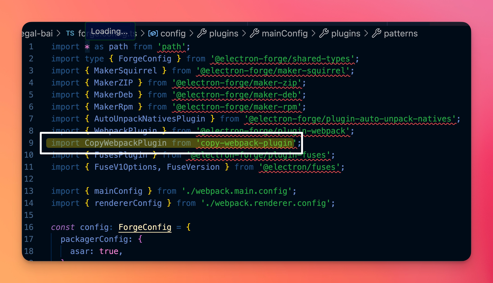
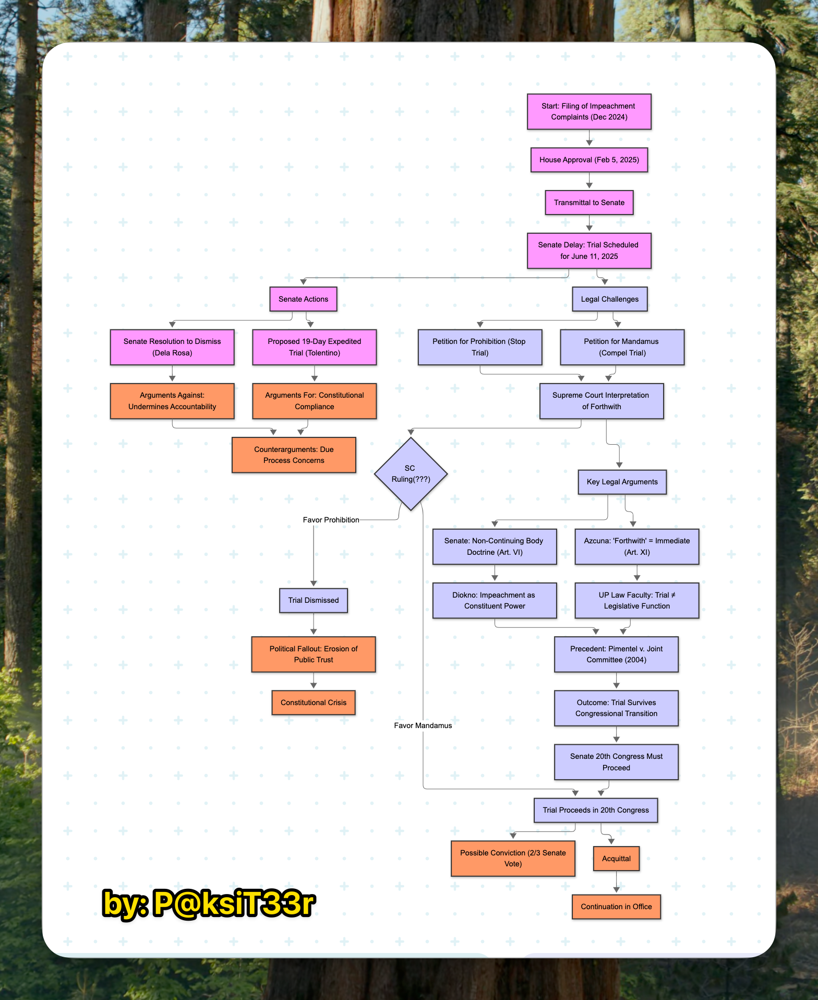

- **[19:36:40]** Gemini 2.5 Pro is good at finding the bug in the code while Claude Sonnet 4 (Reasoning) is really good at overall refactoring of code. Let me explain. `CopyWebpackPlugin` is the culprit. Claude reiterated its mistake around 4x to no avail. In frustration, I asked Gemini regarding the issue. And Gemini spot
	- {:width 735.8358154296875}
- **Impeachment Timeline & Legal Process Flow**
  ==The flowchart highlights tensions between procedural delays and accountability mandates under Art. XI.==
	- {:width 552.2457275390625}
		- This diagram maps VP Sara Duterte’s impeachment proceedings from the December 2024 complaint filing to current constitutional disputes.
	- ## Key stages:
		- **House Approval** (Feb 2025) → **Senate Delay** (trial set for June 11, 2025)
		- **Legal Challenges**:
			- *Mandamus* (force trial) vs. *Prohibition* (stop trial) petitions to Supreme Court
			- Debate over "forthwith" (immediate trial) vs. Senate’s "non-continuing body" claim
		- **Senate Proposals**:
			- Tolentino’s 19-day expedited trial vs. Dela Rosa’s dismissal resolution
		- **Scholars’ View**: UP Law faculty argues trial transcends congressional sessions (constituent power).
		- **Outcomes**: SC ruling could trigger trial continuation (20th Congress), dismissal, or constitutional crisis.