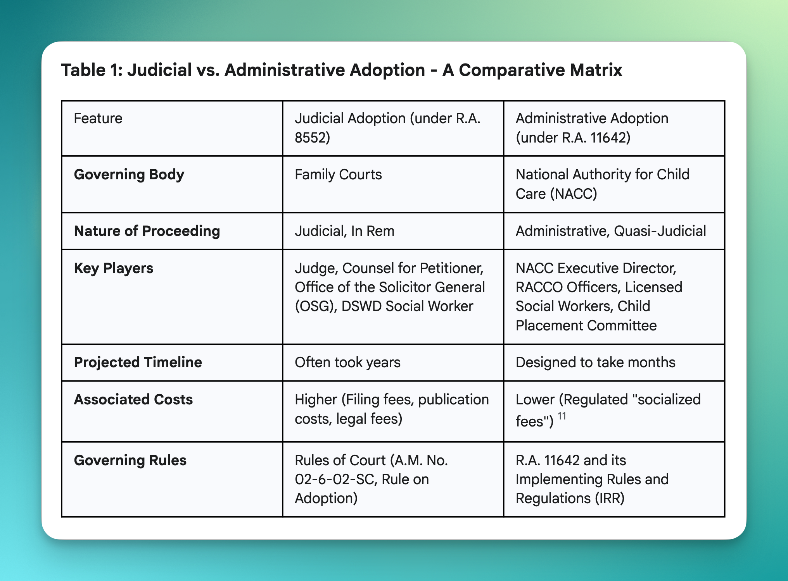
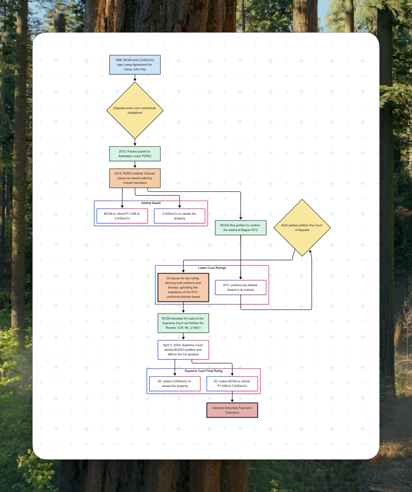

- **[15:51:29]** **Adopted Children - R.A. No. 11642 or the Domestic Administrative Adoption and Alternative Child Care Act.** This law may be one of the source of topics for SPJI. The divesting of judicial procedure to a quasi-judicial agency.
	- {:width 844.0321044921875}
	- *Full summary can be found at my [Github repo.](https://github.com/cliffordx)*
- **[14:40:48]** A possibility that this law (R.A. No. 11909) or **Permanent Validity of the Certificates of Live Birth, Death, and Marriage Act** is very much likely related to SPJI topic in Civil Law.
	- #+BEGIN_QUOTE
	  The law also contains a forward-looking technological mandate, requiring the **PSA and the Department of Information and Communications Technology (DICT) to develop a civil registry database and a virtual viewing facility.** This signals a fundamental policy shift from a document-centric system, where the physical paper is the primary proof of authenticity, to a data-centric one where verification will eventually be done by querying a trusted digital database. This will ultimately render debates over the "date of issuance" moot and has profound implications for efficiency, fraud reduction, and data privacy.
	  #+END_QUOTE
- **[10:52:21]** BCDA v. CJH Development, G.R. No. 219421, April 03, 2024: Upholding Arbitral Finality and Defining the Limits of Judicial Review
	- **THE ANATOMY OF A MULTI-DECADE DISPUTE:** FROM ARBITRATION TO APPELLATE TURMOIL
	- {:width 814.8786010742188}
	- {:width 842.4260864257812}
	- *Full summary can be found at my [Github repo.](https://github.com/cliffordx)*