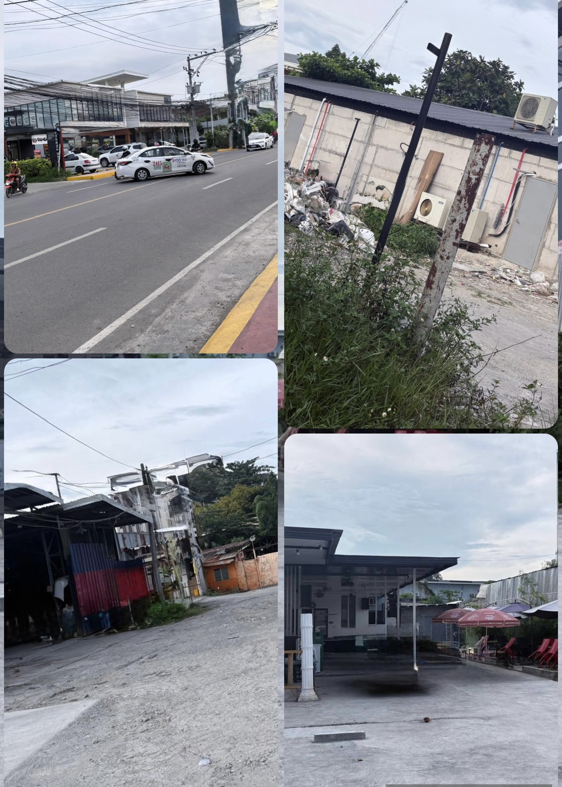

- # 🔥 PRIME LOT FOR SALE — KASAMBAGAN, CEBU CITY
  📍 Along Main Road | 62-Meter Frontage | Price: Php 160,000 pesos per square meters
- ## OVERVIEW
- Rare main-road property in Barangay Kasambagan offering exceptional visibility and access.
- Excellent, efficient lot shape—ideal for maximizing buildable area and development density.
- Highly strategic location minutes to Ayala Center Cebu, Cebu Business Park, and Cebu IT Park.
	- {:width 575.39990234375}
-
- ## PROPERTY HIGHLIGHTS
- Frontage: 62 meters along a primary thoroughfare—strong presence and branding potential
- Shape: Efficient configuration suited for multi-tower or campus-type master planning
- Access: Potential for multiple ingress/egress (subject to final plans and approvals)
- Exposure: High daily vehicle and foot traffic; premium signage and retail podium potential
- Utilities: Major utilities available along the road (power/water/telecom); buyer to confirm providers
- Documentation: Available for qualified buyers; details upon request
- ## IDEAL USES
- High-rise or mixed-use condominium development
- School, university, or review center campus
- Office/clinic/medical facility or boutique commercial complex
- Hospitality or serviced residences (subject to zoning and approvals)
- ## LOCATION ADVANTAGES
- Near Ayala Center Cebu and key business districts
- Quick access to Cebu IT Park, major hospitals, schools, and transport links
- Established, in-demand neighborhood with strong land appreciation and end-user demand
- ## INVESTMENT CASE
- Wide main-road frontage of 62 meters is scarce within the city core
- Highly visible site supports premium retail/commercial podium rents
- Strong buyer and leasing markets driven by surrounding business hubs and residences
- Best value for a main-road property in Cebu City
- ## BUYER NOTES
- Zoning, allowable FAR/height, setbacks, and any road-widening to be verified by buyer with Cebu City CPDO/OBO and relevant agencies
- Site visits strictly by appointment
- Direct Buyers Only
- ## CONTACT
  📞 0917-771-7460 (Globe / Viber / WhatsApp)
  Serious inquiries only. Letters of Intent from qualified buyers are welcome.