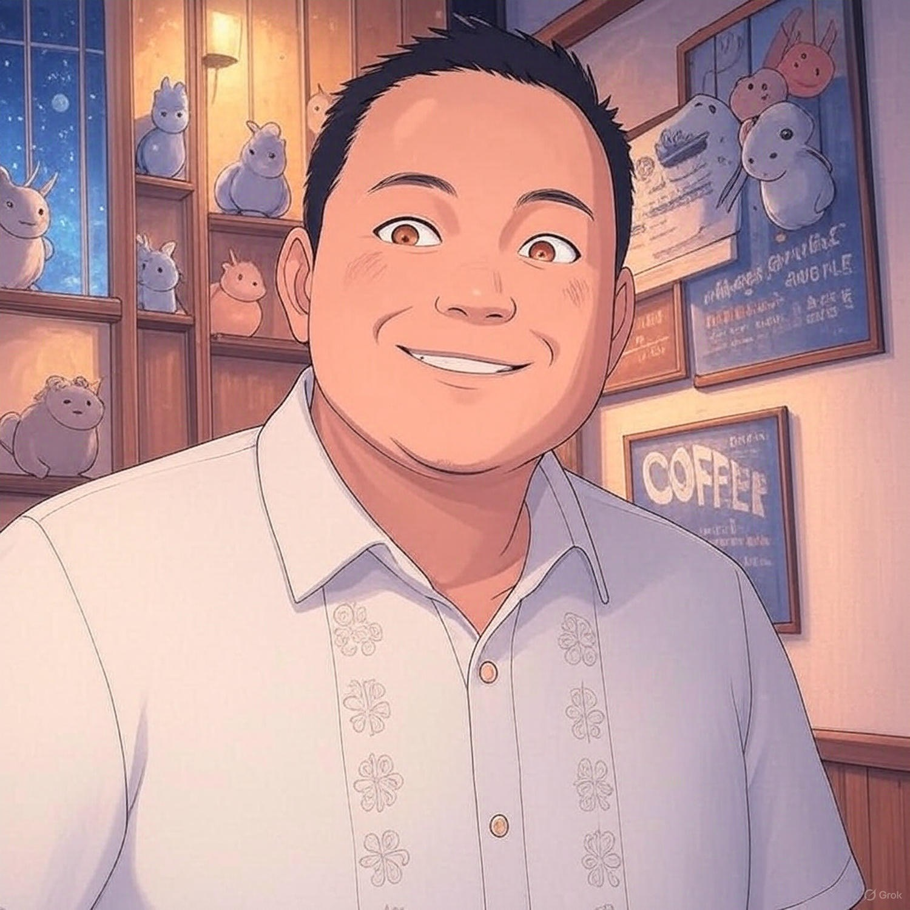

- ((645447b1-515d-4ff6-b0a7-b115dccb9ef9))
- {:height 222, :width 215}
- #### 🙌 **[[Clifford Enoc]]**
	- ***Licensed Real Estate Broker***
	- Cebu, Philippines
	- [Youtube Channel](https://www.youtube.com/cliffordenoc)
- [[Welcome page]]
- 📚[1987 Constitution]([[CONSTI_1987_Annotated]]) 📚[Family Code]([[codal/Family Code of the Philippines]]) 📚[Civil Code]([[CIVIL CODE]]) 📚[Rules of Court]([[ROC_Annotated]]) 📚[Insurance Code]([[codal/Special_Laws/The_Insurance_Code]])
- [Index cards]([[Index_Cards]])
  collapsed:: true
	- {{cards [[Rules on Evidence Flashcards]] }}
- [***Disclaimer***](((635b3d4a-3926-469b-8dd5-980f6f7c1721)))
- #+BEGIN_NOTE
  This Github Page is a [work in progress]([[WIP]]), so please bookmark it so you can come back anytime and check out my latest post. Thank you!
  #+END_NOTE
- id:: 63610783-e8fa-47af-80d8-bd1ce0f6bcc4
  > “We've always defined ourselves by the ability to overcome the impossible. And we count these moments. These moments when we dare to aim higher, to break barriers, to reach for the stars, to make the unknown known. We count these moments as our proudest achievements. But we lost all that. Or perhaps we've just forgotten that we are still pioneers. And we've barely begun. And that our greatest accomplishments cannot be behind us, because our destiny lies above us.” ― **Cooper - Interstellar**