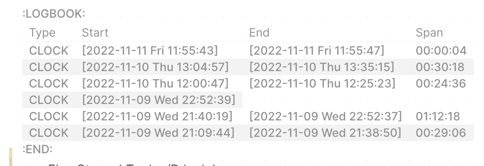

- [[Mihaly Csikszentmihalyi]] in the 1970s described “flow,” the state in which being highly focused becomes effortless.
	- That's why, when I used [[pomodoro]] before, it became a friction and a distraction. Instead, if I do "deep work," I set no time limit. I just hit the `NOW` button (in logseq) and start working after which, I click stop and it logs my time spent. See example screenshot below:
		- 
- From the Book 'Flow":
	- > "==Focused attention is different from “sustained attention,"== which we need to stay focused on one task for a longer period and is necessary to learn, understand or get something done. This is the kind of attention that is most certainly under threat from an increase in distractions. The average duration seems to have shrunken quite considerably over time – we practice much less focused attention than we used to (ibid).”